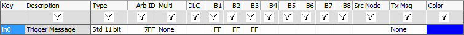

# Logging - Part 1: General Setup

### Open Vehicle Spy:&#x20;

The first step, as with any Vehicle Spy project, is to open Vehicle Spy and Log in.

### 2. Trigger Message:&#x20;

This will be the message to look for.  When this message is received, a short post capture will be collected.  After the post capture, the partition will be changed.  This trigger does not have to be a message but could be a signal value, Misc input, or any other type of trigger condition that can be setup for standalone logging.  In the example file a Receive HS CAN message will be used with the following Parameters:

### 3. Partition Index:&#x20;

To keep track of which partition is being logged to, an [application signal](../../vehicle-spy-main-menus/main-menu-scripting-and-automation/application-signals/) is needed.  In the example file this is called "PartitionIndex".  This will have to be an analog signal type.

### 4. Capture Function Block:&#x20;

Next a [capture function block](../../vehicle-spy-main-menus/main-menu-scripting-and-automation/function-blocks/function-blocks-types/capture-type-function-block/) needs to be setup.  The settings to use are listed below:\
\
Filter:  Default settings or create a filter for the messages of interest.\
\
Start:  Start Immediately and make sure "Automatically restart when complete" is checked.\
\
Stop and Trigger:  Configure this to collect in a one-shot buffer with a buffer size of 50000.\
\
Storage:  Default settings.
