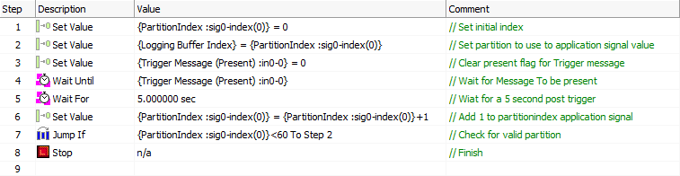

# Logging - Part 2: Function Block Setup

### 1. Control Function Block:

The control [function block](https://cdn.intrepidcs.net/support/VehicleSpy/spyTestScriptFB.htm) is a script that will tell the capture function block to change partitions when the trigger condition is met.  There are a number of ways to do this script.  The basic functionality would be to:\

1. Set your index
2. Wait for condition to change partition
3. Change partition
4. Make sure you are accessing a valid partition

The script in the example is shown below.&#x20;

