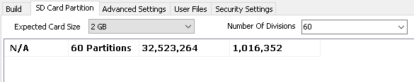

# Logging - Part 3: Sending the Script to the Hardware

### 1. Send the Script to Hardware:&#x20;

Sending the script to the hardware is done the same way as normal with one extra step.  In the CoreMini Console, the SD Card Partition tab lets you configure the number of partitions to use.  The example for this application note uses 60 partitions.  Keep in mind that the more partitions used, the fewer number of messages that can be stored per partition.

### 2. Extract the Data:&#x20;

When the data is extracted from the SD Card, the files extracted will have the partition index in the file name.
