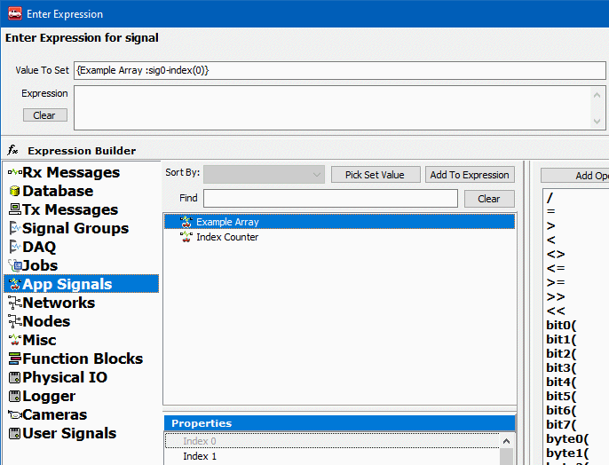

# Application Note: Dynamically Manipulating Application Signal Arrays

### Understanding how Application Signals interact with Application Signal Arrays

After setting up the Application Signals, the next step is to use the application signal that has been designated as the index value as a counter for the application signal that has been designated as the array. This is done using Script Function Blocks, but in order to do this, it is important to understand what an application signal looks like in a Script Function Block.

Note in the image above the Value to Set. This is the notation for an Application Signal in Script Function Blocks. The important thing to note for this is the value after the ':', which in this case is 'sig1'. This 'sig1' is the key value for the Application Signal, so whenever using an Application Signal to loop through anything in function blocks, this is the value that will need to be used.

The above image shows the same setup as the image above, but with an Application Signal array instead of a standard Application Signal. Again, note the 'sig0' for the application signal, which is the key value for the application signal array, but also note the '-index(0)' afer the key value, and how it correlates with the Index 0 property in the field below. By replacing the static value with a counter, the index of the Array Application Signal can now be set dynamically. This is done by substituting the static index value of the Array Application Signal with the key value of the Standard Application Signal being used as the counter, as seen below.

This basic setup can now be manipulated in all the same ways that an application signal can be in Script Function Blocks. Please continue to the next page to see an example Script Function Block that utilizes the concepts above.
