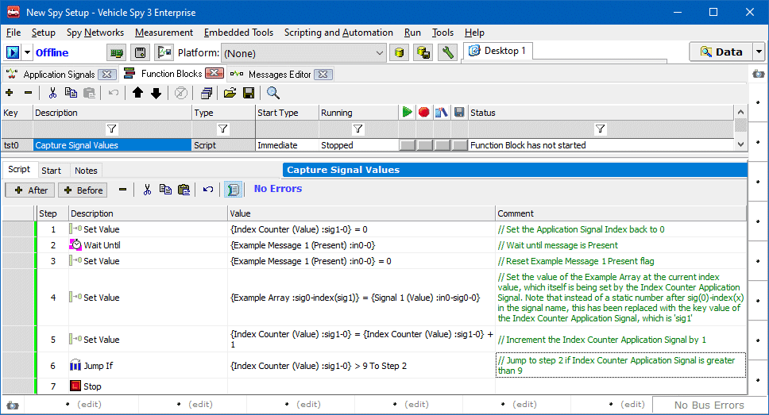
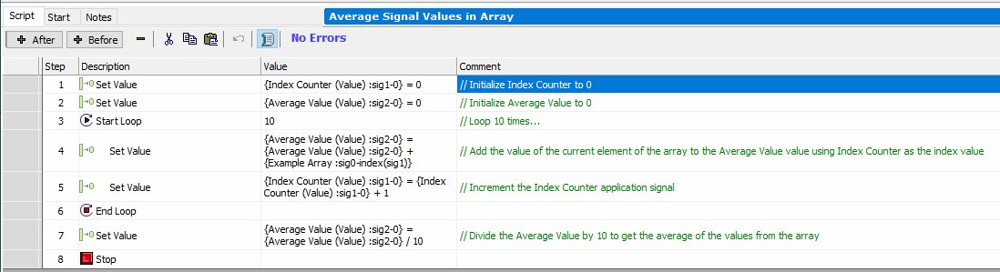

# Application Note: Dynamically Manipulating Application Signal Arrays

### Looping through an Application Signal Array in a Function Block

Below is an example of a simple function block that will store the values from Signal 1 in Example Message 1 in the Application Signal array Example Array, which has size of 10.

Once the values you are looking to capture are stored in an array, you can manipulate and use that data in similar ways. In the function block below, the array is used to generate an average of all the stored array values using a loop, as an alternative to using Jump If.

