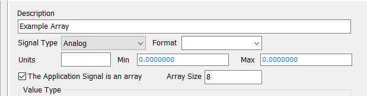

# Application Note: Dynamically Manipulating Application Signal Arrays

### Setting up the Application Signal

In order to loop through an Application Signal Array, an application signal needs to be set as an array. To do this, create an [Application Signal](../../vehicle-spy-main-menus/main-menu-scripting-and-automation/application-signals/) and check the box next to 'This Application Signal is an Array'.

Next, another Application Signal will need to be created. This second application signal will be used to set the index value of the Application Signal Array above.
