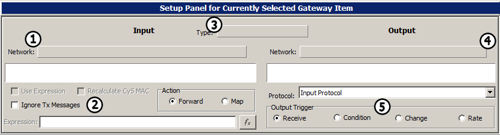

# Tutorial - Gateway Builder - Part 2 - Gateway Builder Overview

The Gateway Builder has several parts to it. The details of each are below.

#### [**Section 1**](tutorial-gateway-builder-part-2-gateway-builder-overview.md#figure-1-gateway-builder-toolbar) **-** [**Section 2**](tutorial-gateway-builder-part-2-gateway-builder-overview.md#figure-1-input-network-view) **-** [**Section 3**](tutorial-gateway-builder-part-2-gateway-builder-overview.md#figure-1-selected-messages-view) **-** [**Section 4**](tutorial-gateway-builder-part-2-gateway-builder-overview.md#figure-1-outgoing-messages-view) **-** [**Section 5**](tutorial-gateway-builder-part-2-gateway-builder-overview.md#figure-1-setup-panel)

### Figure 1:  - Gateway Builder Toolbar:

The toolbar in the Gateway Builder features the following options:

\

* Figure 1 - 1:  - Disable/Enable Button - Turns the gateway created by the Gateway Builder on and off
* Figure 1 - 1:  - Gateway Selector - Add, Remove, and Rename Gateway setups, as well as switch between them
* Figure 1 - 1:  - Undo/Redo Buttons - Undo or Redo changes to the current gateway setup
* Figure 1 - 1:  - Used to delete specific or all messages, signals, and networks, and to gateway an entire network with one click
* Figure 1 - 1:  - Miscellaneous Options:
  * Show Decodings in Messages View - Shows the decoded signals values for messages in Messages view if using a database
  * Attempt Match - Attempts to Match Messages and Signals by name
  * Allow Duplicates - Allows the selection of duplicate signals in the Gateway Builder. With this unchecked, only one duplicate signal will be enabled at a time.
* Figure 1 - 1:  - CoreMini Button - Opens the CoreMini Console so a CoreMini Script with the selected database can be sent to neoVI hardware

### Figure 1: - Input Network View:

The Input Network View is where networks, messages and signals can be selected and added to the current gateway.

* Figure 1 - 1: - Select Input Network - The input network can be selected from the dropdown menu. The sorting order of messages can be changed to sort by message or sort by ECU. Specific message and signal names can be searched for in the box next to 'Find'.
* Figure 1 - 1: - Message and Signal table - Any messages and signals that are part of the selected 'Input Network' will show up here
* Figure 1 - 1: - Input Buttons:
  * Set as Input - Change the input message of the highlighted message in Selected Messages view
  * Exclude - Used to exclude messages from a gateway. Only used if an entire network is in the selected gateway
  * Selected - Adds the selected input message(s) to the gateway
  * Not Selected - Adds all input messages that are not selected to the gateway
  * All - Adds all input messages to the gateway

### Figure 1: - Selected Messages View:

The 'Selected Messages' view shows what messages are part of the gateway being built, and also shows what network and message they are being outputted to, sorted by the column names at the top of the view. The top part of the view shows messages and networks included as part of the gateway, and the bottom part of the view shows messages excluded from the gateway when gatewaying an entire network. The width of the columns can be adjusted manually, and can be reset to their default position by clicking the 'Reset Column Sizes' button.

### Figure 1: - Outgoing Messages View:

The Outgoing Messages View provides the same functionality for outputted messages that the Incoming Message View does for inputted messages with a few less options.

* Figure 1 - 4: - Select Output Network - This functions identically to the 'Select Input Option' above (figure 2 - 1:with the exception that it handles outgoing gateway messages.
* Figure 1 - 4: - Output Messages View - This shows any options for outgoing messages for the selected gateway. Depending on the gateway being built, this is where to access outgoing messages to either view the list, or to map them to an incoming message. This will be explained in detail later in the example
* Figure 1 - 4: - Set as Output - This button functions identically to the 'Set as Input' button (Figure 1 - 2:) with the exception that it handles outgoing gateway messages.

### Figure 1: - Setup Panel:

This panel is where adjustments can be made to networks, messages and signals that are part of the gateway being built

* Figure 1 - 5: - Input Network - The top box shows the current selected input network and the bottom box shows what is being inputted specifically, whether it be a message, a signal, or the entire network
* Figure 1 - 5: - Input Options:
  * Use Expression: use this to change the value of a signal before the signal gets gatewayed.
  * Recalculate CyS MAC: Proprietary Feature
  * Ignore TX Messages: Used when making a bi-directional gateway to make sure the gateway does not trigger on its own transmit messages.
  * Action: Use this to determine where the Input message or signal is forwarded to. Forward simply forwards the message to the new network. If Map is selected, the gateway will forward the message data to a new message entirely
* Figure 1 - 5: - Output Type - The type of item being gatewayed will appear up here as Network, Message or Signal
* Figure 1 - 5: - Output Network - This functions as the input network, except it specifies the Output Network parameters
* Figure 1 - 5: - Output Options:
  * Message Box: This is where Output Messages can be dragged and dropped when mapping an Input message to an Output message
  * Protocol: This allows changing the protocol of the Output message. Input Protocol will keep the protocol the same, CAN is a standard can message; if the input message is over 8 bytes, the message will be truncated, though ISO 15765-2 frames are still passed, and CAN FD with and without Bit Rate Switch
  * Output Trigger: Here is where to change when to send the Output message. Receive will send the Output message when the Input message is received, Condition will send the Output message when a condition, set up in the expression builder, is met. Change sends the Output message whenever any of the data bytes change. Rate sends the Output message at a set rate
