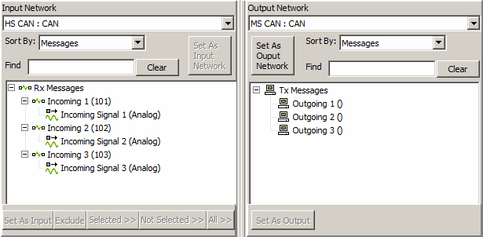
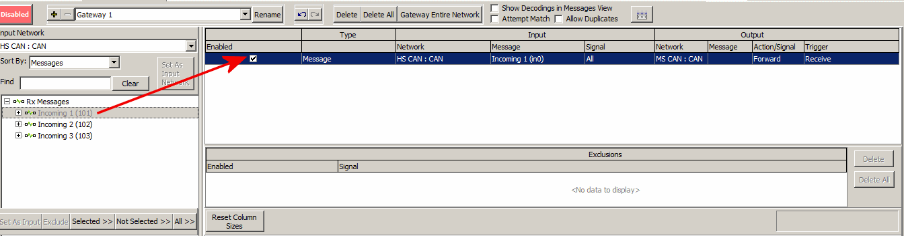

# Tutorial - Gateway Builder - Part 3 - Add Messages to Gateway Builder

### Open the Gateway Builder:

Open the Gateway Builder by clicking on Embedded Tools --> Gateway Builder.

### Set the Correct Input and Output Networks:

At the top of the Input View and the Output View, there will be an option for 'Input Network' and 'Output Network', respectively. As per the setup in Part 3, set the 'Input Network' to HS CAN if it is not already. Then set the 'Output Network' to MS CAN. Click on the expand (+) button next to Rx and Tx Messages to get a list of all messages on the network. The Input and Output views should then match the image below.

### Select Messages to Add to the Gateway:

To start, drag Incoming 1 from the Input Network view to the Selected Networks View.

This sets Incoming 1 as a message the Gateway Builder will use and retrasmit according to the specifications set for the current gateway. Any messages from the input network that need to be gatewayed will need to be dragged into this middle view. From here, the message can be gatewayed in a number of ways, covered in the upcoming sections of the tutorial.
