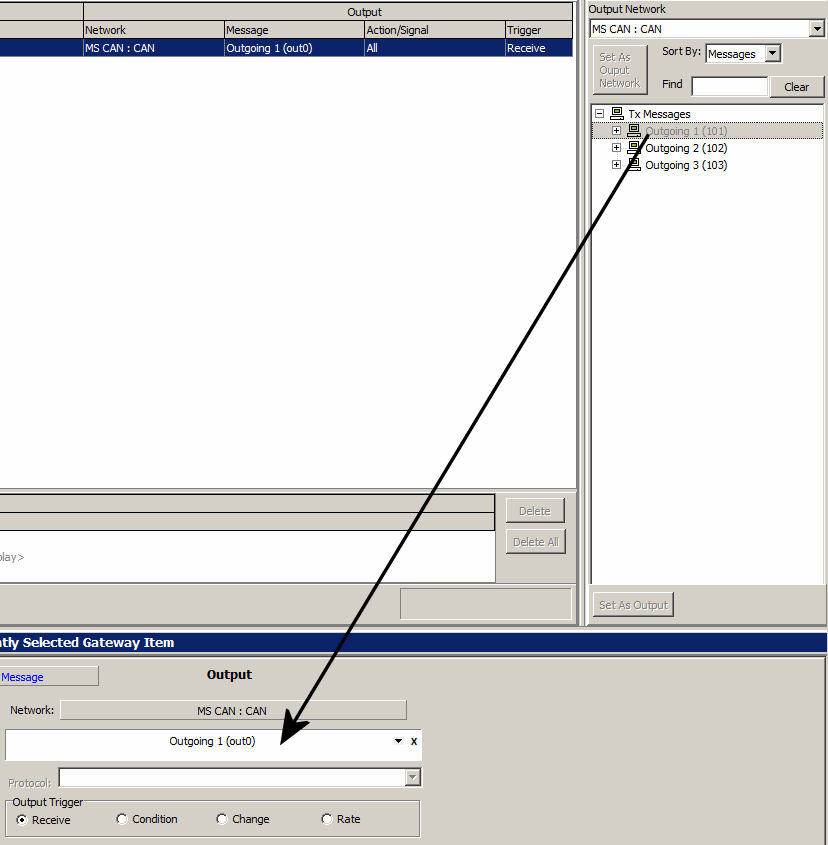

# Tutorial - Gateway Builder - Part 4 - Gateway Input Actions

### Types of Input Actions: Forwarding

Unless an entire network is being gatewayed, one of two options will determine how a the gateway handles input messages and signals. The first option is forward, which is selected by default. Forward simply means the input message or signal will be gatewayed to the output network without any change to its data. In the provided example, set up Incoming 1 to be forwarded by dragging the message from Input Network to the Selected Messages window in the middle, then make sure that the 'Forward' option is selected, and it will be gatewayed from HS CAN to MS CAN. Please note that when forwarding, the gateway will not use any created messages.

### Types of Input Actions: Mapping

Mapping a message or signal allows the user to choose what output message and/or signal the input data is gatewayed to. This example will show how to map from Incoming 1 to Outgoing 1. Since Incoming 1 is already in the Selected Messages area, there are only 2 remaining changes to map Incoming 1 to Outgoing 1. First, select Map instead of Forward, as seen in figure 1. Next, drag Outgoing 1 from the Output Network view to the Output Message area in the Setup Panel (see Figure 3).

Once Outgoing 1 has been moved to the Output Message area and the gateway is enabled, all Incoming 1 message data will be mapped to Outgoing 1.

### Forwarding and Mapping Signals

Signals can be forwarded and mapped nearly the same way as messages were forwarded and mapped above. That being said, there are a few more options available when gatewaying signals. Drag and drop a Incoming Signal 1 into the Selected Messages view, then look below to see how the Input options change.

Note in Figure 4 above that the 'Use Expression' box is checked, and an Application Signal has been added to the 'Expression' box. Using the 'Use Expression' option will replace the incoming signal with whatever data is specified in the 'Expression' box before gatewaying the signal. The only other option is 'Ignore Tx Messages'. This option is only available when gatewaying an entire network, and prevents Tx messages on the Input network from gatewaying themselves.
