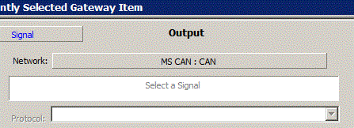
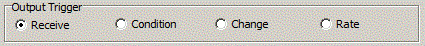

# Tutorial - Gateway Builder - Part 5 - Output Messages, Signals, and Triggers

### Output Messages and Signals

Just like input messages, output messages have their own settings that dictate the messages gateway conditions. First, as briefly mentioned in the previous section of this tutorial, you have the Output Message/Signal Selection, the area where a message or signal can be selected for output. Remember this is only an option if the 'Map' action is selected for the input message or signal. Beneath this is the 'Protocol' drop down menu. This menu is only accessible when gatewaying an entire network, and allows the user to change the protocol of incoming messages to a different protocol, selectable between CAN, CAN FD with BRS, and CAN FD without BRS.

### Output Triggers

Unique to the Output Setup are the options for an output trigger. There are four options to trigger the transmission of a gatewayed message, Recieve, Condition, Change, and Rate. The Recieve option is selected by default and is the most basic option of the four; when the specified input message is received, it will be gatewayed. Next, the Condition option allows a condition to trigger the output message. For example, a message could be triggered to output only when its input message has been transmitted 10 times. The condition is set using the rules and logic of the Expression Editor. The 'Change' trigger simply outputs the message when the input messages data changes, and, finally, the 'Rate' trigger will output a message at either the rate of the input message, or at a specified rate.
