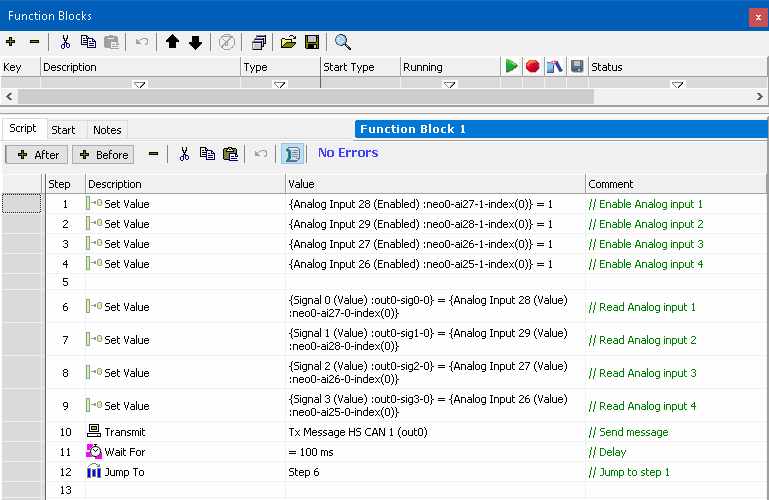

# Application Note: neoVI Logging neoECU DAQ - Part 1: neoECU Setup

### Overview

In this section we will setup the CoreMini file that we will be loading into the neoECU, which is going to take 4 analog inputs that we will assign to signals in an HS CAN transmit message.  We will later log and decode these signals.

### Process:

1. Setup one HS CAN transmit messages, with 4 signals.
2. Create a function block script that will set each signal value into an analog input.  Then transmit the messages.  For help working with the analog inputs on a neoECU 10, see the [IO map for the neoECU 10](../../vehicle-network-interface-hardware/getting-started-with-neoecu/neoecu-10/neoecu-10-io-map.md).
3. Save this file as (your name)ECUCoreMini.vs3
4. Load this CoreMini into the neoECU device. (For help on this topic see the [neoECU 10 Script loading](../../vehicle-network-interface-hardware/getting-started-with-neoecu/neoecu-10/neoecu-10-loading-scripts-over-can.md).  If you are using a different neoECU device try this [link](../application-note-coremini-partition-logging/).)

