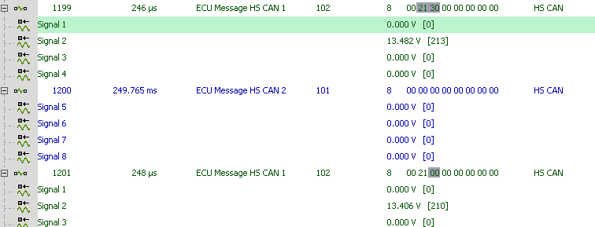

# Application Note: neoVI Logging neoECU DAQ - Part 3: Review Data

### Overview

In this section the data will be extracted from the neoVI and reviewed.

### Process:

1. Extract the data from the SD card.  This is done using the Extract / Export view found under Tools -> Utilities.&#x20;
2. With the data extracted, it can be looked at Review buffer or Data Analysis.

