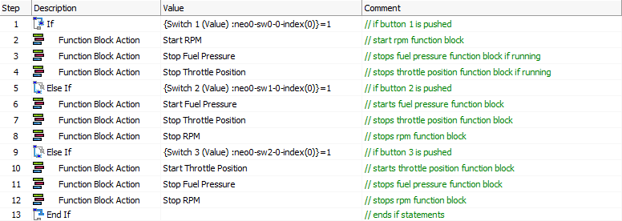

# Application Note: Using the neoVI MOTE - Part 1: Messages

### 1. Open Vehicle Spy:

The first step, as with any Vehicle Spy project, is to open Vehicle Spy and Log in.

### 2. Create Rx Messages:

The example file has 4 Rx messages defined for J1979 diagnostic requests. You can create these messages or you can create your own if you would like to see different signals.

### Create a Script Function Block:

Our first script will program our buttons for the neoVI MOTE.

