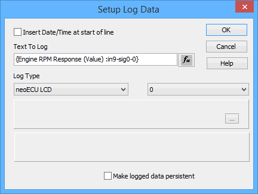
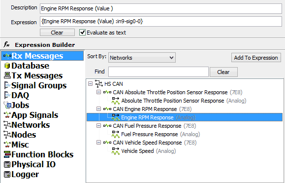
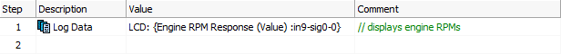
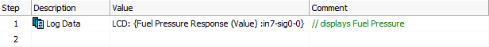
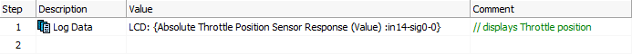

# Application Note: Using the neoVI MOTE - Part 2: Display on Screen

### 1. More Script Function Blocks:

In this step we will assign a signal to buttons 1, 2, and 3. Button 4 will act as a "Home" button to stop any running function blocks and display "neoMOTE" on the screen. To do this, create a new function block for each button: RPM, Fuel Pressure, Throttle Position, and Home Screen.

### 2. Display on neoVI MOTE's Screen:

This is done using the Log Data command which is shown below. Using the fx button, select your signal or simply type text. Make sure the "Evaluate as text" check box is checked.  This will tell the software that the expression is text instead of an equation.

### 3. Create Your Function Blocks!

The above picture is the RPM function block, using the Log Data command.

The above picture is the Fuel Pressure function block, using the Log Data command.

The above picture is the Throttle Position function block, using the Log Data command.
