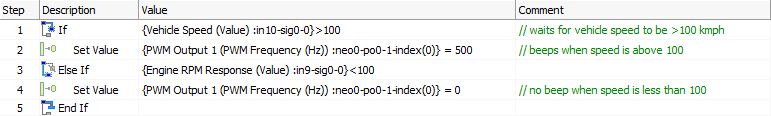
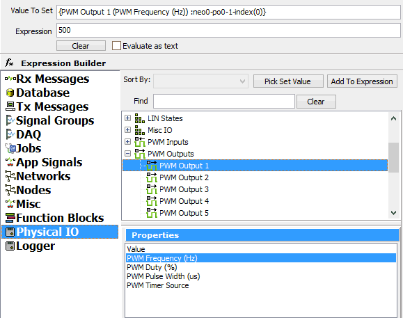

# Application Note: Using the neoVI MOTE - Part 3: Using the Speaker

### 1. Function Block Script to Control the Speaker:

In this function block we use an "If" statement to wait for the Vehicle Speed signal value to be greater than 100 kmph. We then set the speaker to output a 500 Hz tone, then use an "**Else If**" statement to turn the speaker off when we are below 100 kmph again.

To set the speaker, go to Physical IO in the Expression Builder, and locate PWM Output 1. This is the speaker output for the neoVI MOTE. To set this parameter, make sure you select PWM Frequency (Hz) in the properties window at the bottom.

