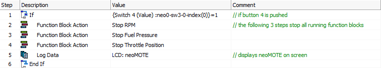

# Application Note: Using the neoVI MOTE - Part 4: Home Screen and Conclusion

### 1. Home Screen Script Function Block:

For our last function block script we are going to create a Home Screen, that will shutdown all running function blocks and display "neoMOTE" on the screen.

### 2. Last Step - Loading CoreMini:

You are now ready to load this into CoreMini. For help on this click here.

### Conclusion:

This concludes the application note of a simple application for the neoVI MOTE. Your neoVI MOTE is now ready to be used to read J1979 signals on its display.
