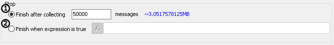
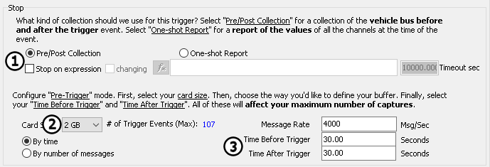
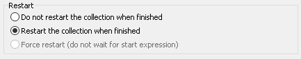

# Application Note: VehicleScape Standalone Logging - Part 2: Collection and Restart Options

### Collection Configuration (Part 1):

This is for those who chose "Immediately" or "When Expression is True" on the previous step. In this menu, you have two options for how you can stop your collection. The simplest method is to stop after a certain number of messages (Figure 1: ). The number of messages to collect may be chosen from the drop down or manually entered in. The other option is to "Finish on Expression" (Figure 1: ). With this option selected, you may set up an expression that will stop your data collection.

### Collection Configuration (Part 2):

If you chose "Using Trigger" in the previous step you will see different setup options than above.  Start this part by choosing one of two options "Pre/Post Collection" or a "One-Shot Report" (Figure 2: ). Next select the size of your SD card (Figure 2: ). Next, select the number of messages you want to be collected before and after the trigger that was defined in the previous step (Figure 2: ). Besides selecting a number from the dropdown you may enter any number of your choice by clicking inside the drop down box. You can also choose a time length before and after the defined trigger. The number in blue reflects the total number of captures that can be saved before the SD card is full.  If you require more captures, you must reduce the total number of messages in each capture.

### Restart Options:

Once you have set the parameters above, you can set if you want to log another collection, or if you want to stop logging after one collection. Alternatively, you can force the start of another collection regardless of the start expression.

