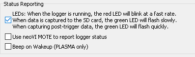
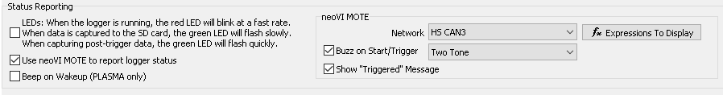
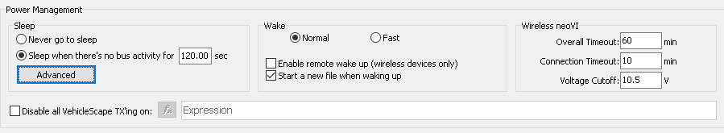
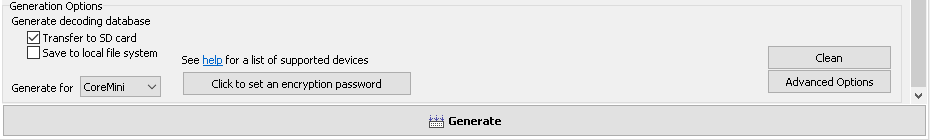

# Application Note: VehicleScape Standalone Logging - Part 3: Reporting Options, Power Management and

### 1. Reporting Options:

You can use the reporting options to monitor your logging activity.  You may choose to use No Reporting, LEDs, a neoVI MOTE, and Wireless neoVI.\
\
No Reporting: If you choose No Reporting (by selecting none of the options), the device will use the default LED blink pattern (Flashing red LED indicating active CoreMini).\
\
LEDs: If you choose LEDs, the Red LED will blink at a fast rate when the logger is running. The green LED will flash slowly when data is being captured to the SD Card, and rapidly when capturing post-trigger data (if you are using Pre/Post Trigger Collection). See Figure 1.

neoVI Mote: If you have a neoVI MOTE, you can use it to view signal values (cycle with buttons 2 & 4) and to manually trigger the capture (button 1). You may also choose a sound to play once the logging has started or triggered. The neoVI MOTE can also display the triggered message when the logger is triggered. You must choose how the neoVI MOTE will be connected. If you are using the provided OBD-II to 25 pin with 9 pin off-shoot you will choose HS CAN 3. Otherwise, check your cabling to determine the correct CAN channel.  The neoVI MOTE must have the "neoVIMOTE Default CoreMini" loaded.  For more information regarding setting up the neoVI MOTE's CoreMini, Click Here. See Figure 2.

Beep in Wakeup (PLASMA only): Enabling this option will cause the neoVI PLASMA to beep When it wakes up.

### 2. Power Management:

Power Management will put the neoVI device into a low power (sleep) state. VehicleScape DAQ has a few options. The first is "Never". This option will used what is configured in the hardware from neoVI 3G Explorer. By default the unit will not go into low power mode. Then next option is to If you choose to enable any type of sleep mode there is functionality for "Instant Wakeup".  This means that the neoVI will not miss any messages (including the message that woke it up). Be aware that this state draws more power than normal sleep mode. See Figure 3.\
\
Never: Will use built in hardware settings configured from neoVI 3G Explorer (default is Sleep Mode disabled)\
\
On No Bus Activity: The last option will put the device to sleep once the bus is quiet. **Note:** **Any Bus activity will wake up the neoVI**.

Just as sleep modes can be configured, wakeup modes can also be configured.\
\
Normal: The hardware will wake up, but will miss a few messages as the device wakes up. This option uses the least amount of power while in sleep mode.\
\
Instant (HS/MS): The hardware will wakeup and not miss messages on HS or MS CAN. Other networks will wake the device up, but may miss the first few messages on non HS or MS CAN channels. This options uses more power than normal.\
\
Drowsy: This options uses the most power, but will not miss messages and will still run scripts.\
\
neoVI Plasma Remote Wakeup: Enabling this will let a neoVI PLASMA wake up from Wireless neoVI.\
\
neoVI Plasma also has the option to upload data before entering a sleep mode. 3G or WiFi can be selected as a transfer method.

### Generate Logger for CoreMini:

At this point you can choose to include database decoding you already have loaded. Vehicle Spy gives two storage options as well which are storing the decoding on the SD Card or on the pc you are using. This section also has an option for saving a VS3ZIP setup for use in Wireless neoVI.  Once you have all the settings configured the way you want them. Press the "Generate" button.  This will open the CoreMini Console.

### 3. CoreMini Executable Generator:

Once the CoreMini console is open, the output window (Figure 5:) will show the results of the generated script.  The console will also select your device from the dropdown list (Figure 5:). Next, make sure that "SD Card" is selected for Storage and "Run CoreMini After Download" (Figure 5:) is checked. Lastly, click the "Send" button (Figure 5:) to transfer the CoreMini to the neoVI. If the Script needs to be removed the Clear button can be used (Figure 5:). You have successfully setup the logger. You can find additional CoreMini Console information Here if needed.

### Conclusion:

This concludes the application note of Standalone Logging. Your neoVI is now ready to be used to logger.
