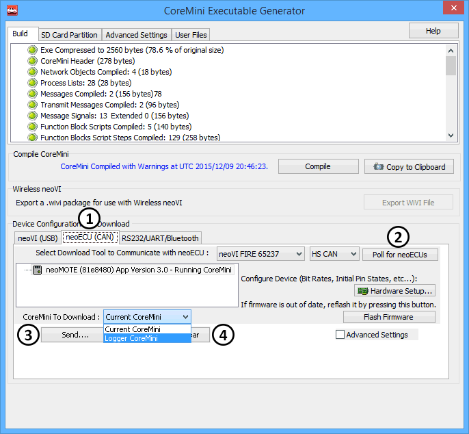

# Application Note: VehicleScape Standalone Logging - Part 4: neoVI MOTE Setup

### 1. Open the CoreMini Console:

Once you have completed the setup for the Logger, go to the CoreMini Console using the Generate button in VehicleScape DAQ or through Tool --> Utilities --> CoreMini Console.&#x20;

### 2. Send the CoreMini to the neoVI MOTE:

Figure 1 shows the CoreMini Executable Generator.  Click on the neoECU (CAN) tab (Figure 1: ). With a neoVI or ValueCAN device connected to the neoVI MOTE, click on the to program the neoECU/neoVI MOTE connected.  You will now need to locate the neoECU/neoVI MOTE by clicking the "Poll for neoECUs" button (Figure 1: ).  Make sure that you have the correct network selected to the left of this button.  If you are using the provided cable with the OBD-II to 25 Pin with 9 Pin offshoot you will choose HS CAN 3 from this drop down.  Next, set the CoreMini to Download to be Logger CoreMini.  On the bottom left you will find the "Send" (Figure 1: ). Click this button when you are ready to send the CoreMini to the device.  If you wish to erase the CoreMini from the device later you may do so by pressing "Clear" .

