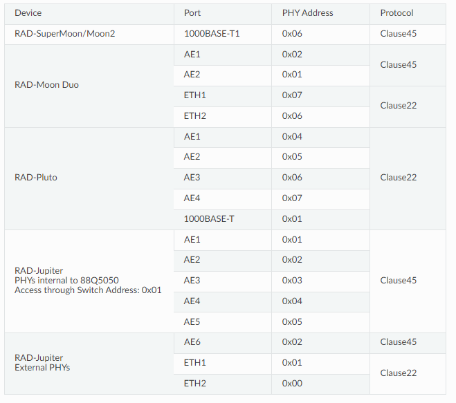
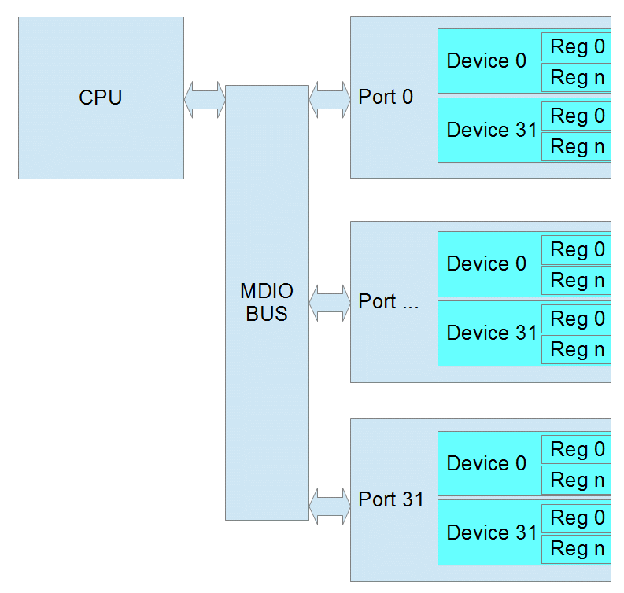

# PHY Dashboard

## <mark style="background-color:blue;">Note</mark>

<mark style="background-color:blue;">The Ethernet Phy Dashboard is a debugging tool. It is not intended to be used for every day work flow.</mark>

### **Two primary things are needed to work with the PHY Dashboard.**

1. The manufacturer’s data sheet of the PHY. This is needed to know the function of the registers and the format of their contents. These data sheets are usually confidential and require and NDA (Non Disclosure Agreement) with the manufacturer.
2. The address of the PHY in the device and protocol used. If your device is not listed below, please contact [support@intrepidcs.com](mailto:support%40intrepidcs.com).

<figure><figcaption></figcaption></figure>

### Opening the PHY Dashboard

The PHY Dashboard can be opened from the Embedded Tools menu in Vehicle Spy (shown below)

<figure><figcaption></figcaption></figure>

### Register Access

### <mark style="background-color:blue;">**MDIO protocol**</mark>

<mark style="background-color:blue;">Most Ethernet Phys communicate using MDIO protocol (Management Data Input/Output). Each frame is 32 bits. There are 2 start bits, a 2 bit operation code, 5 bit phy address, 5 bit register address, 2 bit turn around delay, and 16 bit data.</mark>

### Clause 22

The initial protocol, IEEE 802.3 Clause 22, was designed to read or write 32 registers within 32 devices. Each read/write is done in one operation.

* Phy Address 5 bits (0 – 31 decimal)
* Register address 5 bits (0 – 31 decimal) or (0 – 1F hex)
* Data 16 bits

<figure><figcaption></figcaption></figure>

### <mark style="background-color:blue;">Page Register</mark>

<mark style="background-color:blue;">Some Ethernet Phy manufacturers added a page register to allow for more registers in Clause 22. The page can be 0 – 255 decimal. If the Phy does not support pages, then page will be ignored. When using pages, reads and writes can no longer be performed in one operation. Instead you must write to the page register and then before any other process changes the page, you can read or write the destination register. If another process were to change the page register before you finish, the result will be an read the wrong register or an write to wrong register which may cause the Phy to stop working.</mark>

### Clause 45

As Ethernet Phys became more complicated and supported different speeds and connections, IEEE 802.3 Clause 45 was added. Because the Register Address is now 16 bits, each read/write takes at 2 operations. The first operation is always writing the Register Address that you want to use in the next operation. The second is the actual read or write. There is also a special read that increments the address after each read which allows you to write a starting address and then read a whole block of registers.

* Port 5 bits (this is equivalent to the Phy Address)
* Device 5 bits (this is similar to the page)
* Register address 16 bits (this allows 65536 registers in each device)
* Data 16 bits

<figure><figcaption></figcaption></figure>

### VSpy Operation

* Add – use this button to add MDIO operations. Ctrl-S saves screen contents to VS3 file.
* Delete – deletes the currently selected item or item.
* Delete All – deletes all operations
* Read One Time – performs all reads from the list once. No writes are performed.
* Write One Time – performs all writes from the list once. No reads are performed.
* All One Time – performs every item in the list once.
* Send Selected – performs only the selected item or items once.
* Start Monitor – performs all reads once per second.
* Stops Monitor – stops the monitor operation.

_Note: all values in Hex except Phy Address/Port_

<figure><figcaption></figcaption></figure>

### Examples

#### Clause 22 Example:

<figure><figcaption></figcaption></figure>

* Line 1 writes soft reset to phy address 16, using Clause 22
* Line 2 reads Phy ID Reg1 from phy address 16 using Clause 22
* Line 3 reads Phy ID Reg2 from phy address 16 using Clause 22

#### Clause 45 Example_:_

<figure><figcaption></figcaption></figure>

* Line 1 writes soft reset of PCS to Port 16, Device 3 using Clause 45
* Line 2 reads PCS ID Reg1 from Port 16, Device 3 using Clause 45
* Line 3 reads PCS ID Reg2 from Port 16, Device 3 using Clause 45

### Common Clause 22 Registers

<figure><figcaption></figcaption></figure>

### Common Clause 45 Registers

#### PMA/PMD Registers

<figure><figcaption></figcaption></figure>

### PCS Registers

<figure><figcaption></figcaption></figure>

### Glossary

**IEEE**

Institute of Electrical and Electronics Engineers

**MAC**

Media Access Control

**MBPS**

Mega Bits Per Second

**MDC**

Management Data Clock

**MDIO**

Management Data Input/Output

**OSI**

Open Systems Interconnection

**OUI**

Organizationally unique ID

**PCS**

Physical Coding Sublayer

**PHY**

Physical layer of the OSI model

**PMA**

Physical Medium Attachment

**PMD**

Physical Medium Dependent
