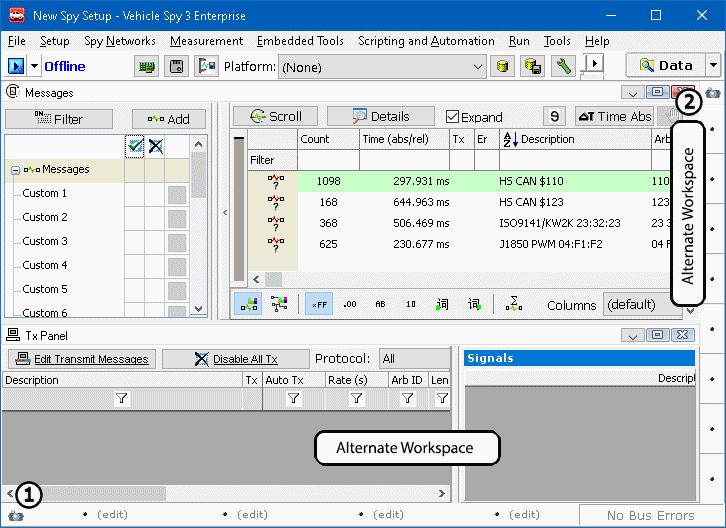

# Alternate Workspaces

Use alternate workspaces to help view more than one Vehicle Spy feature simultaneously. It could be useful, for instance, to monitor Messages while manually sending a message with the Tx Panel, or have a Graphical panel displaying data requested by the Diagnostics view.

Open an alternate workspace by clicking the **small camera** icon (Figure 1: & ). Clicking a camera icon opens a list of the Vehicle Spy main menu selections. Simply choose the view you wish to use and it will be docked in the alternate workspace.

The alternate workspaces are separated from the main workspace by thin, gray borders. Click and drag on the borders to change the size of the workspace.

