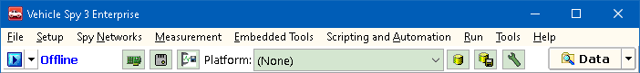
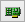
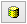

# Menus & Buttons

Vehicle Spy is designed to be easy to use. All functions of Vehicle Spy can be accessed through the main menus found along the top of the user interface as shown in **Figure 1**.

Also located along the top of the user interface are buttons that make working with Vehicle Spy more convenient. Refer to **Table 1** for details on the various toolbar selections.

**Table 1: Vehicle Spy Toolbar Selections**

| Toolbar Selection                                                            | Description                                                                                                                                                                    |
| ---------------------------------------------------------------------------- | ------------------------------------------------------------------------------------------------------------------------------------------------------------------------------ |
|  Blue Play/Stop button                       | Takes Vehicle Spy online or offline with one mouse click.                                                                                                                      |
| Online Mode pulldown button                                                  | Selects which mode Vehicle Spy will run with when going online.                                                                                                                |
|  Setup Hardware button              | Opens Hardware Setup dialog to configure hardware and networks. This is the same as using the Setup > Hardware main menu.                                                      |
|  Setup ECUs button                      | Opens ECUs view to setup diagnostic information for ECUs. This is the same as using the Spy Networks > ECUs main menu.                                                         |
|  Data Cache button                      | Opens a dialog to data cache lots of unfiltered data into binary files. This is the same as using the Setup > Data Cache Disk Streaming main menu.                             |
| Platform selection                                                           | Selects a platform (a collection of databases) to decode data. This is the same as the Current Platform selection on the Logon, Network Databases, and VehicleScape DAQ views. |
|  Setup Network Databases button   | Opens the Network Databases view to configure hardware and networks. This is the same as using the Setup > Network Databases menu.                                             |
|  Save Platform Changes button | Saves all platform database changes.                                                                                                                                           |
|  Setup Platforms button            | Opens a dialog to add, rename, copy, and remove platforms. This is the same as using the Setup Platforms button on the Network Databases view.                                 |
|  Desktop tabs                             | Multiple desktops are supported within Vehicle Spy using these tabs. Use the right click menu on these tabs to rename, add, or remove the desktops.                            |
|  Data Folder button                    | Opens the data directory of the current user logged on.                                                                                                                        |
| Data Folder pulldown button                                                  | Opens recently saved buffer files for review and gives access to Data Cache Disk Streaming features.                                                                           |
