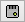

# Menus & Buttons

Vehicle Spy is designed to be easy to use. All functions of Vehicle Spy can be accessed through the [main menus](../vehicle-spy-main-menus/) found along the top of the user interface as shown in **Figure 1**.

Also located along the top of the user interface are buttons that make working with Vehicle Spy more convenient. Refer to **Table 1** for details on the various toolbar selections.

**Table 1: Vehicle Spy Toolbar Selections**

| Toolbar Selection                                                                                                                               | Description                                                                                                                                                                    |
| ----------------------------------------------------------------------------------------------------------------------------------------------- | ------------------------------------------------------------------------------------------------------------------------------------------------------------------------------ |
|  [Blue Play/Stop but](running-and-stopping.md)ton                                                               | Takes Vehicle Spy online or offline with one mouse click.                                                                                                                      |
| [Online Mode pulldown button](running-and-stopping.md)                                                                                          | Selects which mode Vehicle Spy will run with when going online.                                                                                                                |
|  [Setup Hardware button](../vehicle-spy-main-menus/main-menu-spy-networks/networks/setup-a-network.md) | Opens Hardware Setup dialog to configure hardware and networks. This is the same as using the Setup > Hardware main menu.                                                      |
|  [Setup ECUs button](../vehicle-spy-main-menus/main-menu-spy-networks/ecus-view/)                          | Opens ECUs view to setup diagnostic information for ECUs. This is the same as using the Spy Networks > ECUs main menu.                                                         |
|  [Data Cache button](../vehicle-spy-main-menus/main-menu-setup/data-cache-disk-streaming.md)               | Opens a dialog to data cache lots of unfiltered data into binary files. This is the same as using the Setup > Data Cache Disk Streaming main menu.                             |
| [Platform selection](../vehicle-spy-main-menus/main-menu-setup/network-databases.md)                                                            | Selects a platform (a collection of databases) to decode data. This is the same as the Current Platform selection on the Logon, Network Databases, and VehicleScape DAQ views. |
|  [Setup Network Databases button](../vehicle-spy-main-menus/main-menu-setup/network-databases.md)    | Opens the Network Databases view to configure hardware and networks. This is the same as using the Setup > Network Databases menu.                                             |
|  [Save Platform Changes button](../vehicle-spy-main-menus/main-menu-setup/network-databases.md)  | Saves all platform database changes.                                                                                                                                           |
|  [Setup Platforms button](../vehicle-spy-main-menus/main-menu-setup/network-databases.md)             | Opens a dialog to add, rename, copy, and remove platforms. This is the same as using the Setup Platforms button on the Network Databases view.                                 |
|  Desktop tabs                                                                                                | Multiple desktops are supported within Vehicle Spy using these tabs. Use the right click menu on these tabs to rename, add, or remove the desktops.                            |
|  Data Folder button                                                                                       | Opens the data directory of the current user logged on.                                                                                                                        |
| [Data Folder pulldown button](../vehicle-spy-main-menus/main-menu-file/data-directory.md)                                                       | Opens recently saved buffer files for review and gives access to Data Cache Disk Streaming features.                                                                           |
