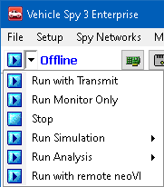
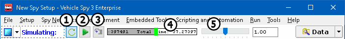

# Running and Stopping

Vehicle Spy can run in a several different modes: Run with Transmit, Run with MEP, Run Monitor Only, Run Simulation, Run Analysis, and Run with remote neoVI. These options are selected by clicking the drop down arrow (Figure 1) next to the blue Start/Stop button.

**Run with Transmit mode (Online)**: Use this mode to connect and start communicating and monitoring a network. This mode will allow messages to be received and transmitted on the bus.

**Run with MEP mode (Online MEP)**: Use Memory Edit Protocol to connect with ECUs that support CCP/XCP while also getting all features from Transmit mode.

**Run Monitor Only mode**: Use this mode to only see messages on the bus and not transmit anything.

**Run Simulation (Simulating: file name)**: Use this to replay a previously recorded buffer file without the need for network hardware. Mouse-over this choice to get a list of recently used simulation files or the option to run with No Replay File. Other simulation files can be selected by browsing for them or using Vehicle Spy Options. Simulation mode can be helpful for building Vehicle Spy files or reviewing buffers.

Simulating with a file includes some tools for controlling the replay as shown in **Figure 2**.

The **Continuous Replay** button (Figure 2: ) sets the replay to be either a continuous loop or to replay once. The **Play/Pause** button (Figure 2: ) starts and stops the replay while keeping Vehicle Spy online in simulation mode. If the replay is paused, a **Single Step** button (Figure 2: ) appears and each click on it triggers the next message in the buffer to be replayed.

A **progress bar** (Figure 2: ) shows how far along the replay is at compared to the full buffer file length. Drag and drop the green slider bar to change the current replay location within the buffer file. To add a break point, double left click anywhere along the progress bar and it will be shown as a vertical red line. To clear one break point, double left click on the red line. To clear ALL break points, double RIGHT click anywhere on the progress bar or stop and start simulation mode with the blue Start/Stop button.

The replay speed multiplier is shown inside the progress bar. A value of 1x represents "real time" with no multiplying effect. Adjust the **speed slide**r (Figure 2: ) left or right to decrease or increase the replay speed.

Replaying files in simulation mode will NOT send data on a physical network; to actually playback a file onto a physical network, setup a Playback function block and use Run with Transmit mode.

**Run Analysis**: Use this mode to run analysis on a file. All of the setups including function blocks will be ran through Vehicle Spy as fast as possible to collect and analyze data faster. The file will only be played once instead of continuously playing.

**Run with remote neoVI:** Use this to mode to locate and connect a neoVI at a different location and run it on Vehicle Spy through a wireless connection via the device's IP address.

### Blue Button Has Dual Start/Stop Action

Notice the blue Start/Stop button is a dual action button. This means that after Vehicle Spy starts the button changes into a stop button. When Vehicle Spy is stopped the button changes back into a start button.

Clicking the **Start** button  causes Vehicle Spy to do all of the following:

* Run the last online mode selected.
* Initialize communication with the hardware.
* Begin monitoring all message traffic.
* Disable editing of nodes and editing of networks.
* Disable deletion of receive and transmit messages.
* Check if any incoming messages referred to in tests or filters were deleted and, therefore, have become invalid.
* Start all tests/function blocks that are set to start immediately.
* Change the Start button into a Stop button (blank blue button).

**Note:** If there are problems starting Vehicle Spy, the cause of the problem will most likely be the hardware. Hardware problems can occur because hardware is either not connected or properly configured. Please see the section on setting up hardware to correct this type of problem.

Clicking the **Stop** button  stops Vehicle Spy and causes the software to do all of the following:

* Allow editing of networks and nodes.
* Enable deletion of receive and transmit messages.
* Stop all tests/function blocks that have not reached completion. This means tests that have not been completed will be forced completed, saved, and analyzed.
* Change the Stop button into a Start button.
