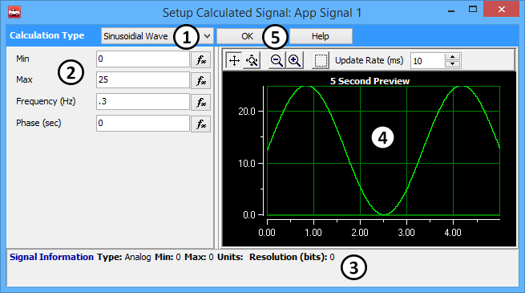

# Shared Features: Calculated Signal Editor

The Calculated Signal Editor (Figure 1) is an easy way to create calculated signals for Application Signals or Tx Panel signals.

Use the Calculation Type drop down to select the desired waveform . The list of choices will depend upon if the signal type is analog/digital or text. The range of choices includes: Random Data, Sinusoidal Wave, Ramp, Triangle, Square, Custom List, Equation, Static Value, and Remote Signal.

Once a Calculation Type has been selected, fill in the parameters for that type of calculated signal in the fields below . Signal information is displayed at the bottom of the editor to help enter in the proper information . It gives the type, minimum, maximum, units, and the resolution of the signal being built.

The right side of the editor displays a 5 second preview showing what the output signal would look like if it was graphed .

Once the signal is setup click the Ok Button to set the changes .

