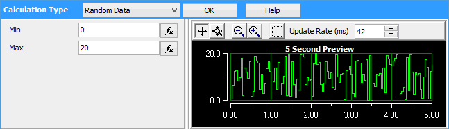
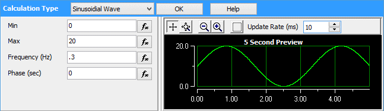
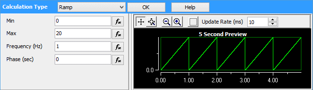
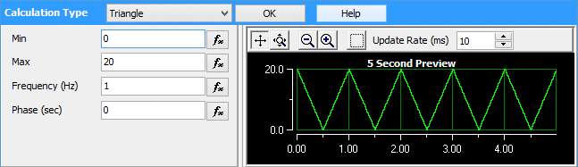
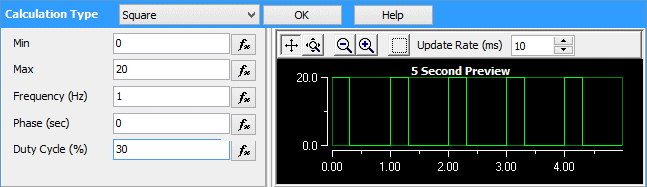
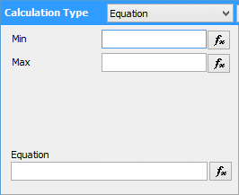
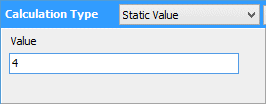
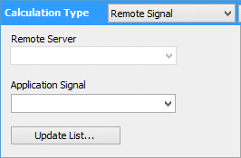

# Shared Features: Calculated Analog or Digital Signals

An Application Signal or a Tx Panel signal can have a numeric value which can be interpreted as an analog or digital Signal Type. There are many different ways a signal can be calculated. The different calculations are created with the Setup Calculated Signal screen. The descriptions for the different options are listed in Table 1 below.\
\
If a signal property has an equation button () next to it, you can enter an equation for the signal instead of a static value. This will let you modify signals based on other Vehicle Spy data. For example, you could use a knob to change the frequency of a sine wave.

**Table 1: Listing of Numeric Calculated Signal Types**

|                                                                                                                                                                    Calculated Signal Type                                                                                                                                                                   |                                                                                                                                            Description                                                                                                                                            |
| :---------------------------------------------------------------------------------------------------------------------------------------------------------------------------------------------------------------------------------------------------------------------------------------------------------------------------------------------------------: | :-----------------------------------------------------------------------------------------------------------------------------------------------------------------------------------------------------------------------------------------------------------------------------------------------: |
|                                                                                        
<strong>Random Data</strong> <strong>Properties</strong>: Min, Max

 
                                                                                        |                                                                                                             This signal calculates a random value between the Min and Max properties.                                                                                                             |
| 
<strong>Sinusoidal Wave</strong> <strong>Properties</strong>: Min, Max, Frequency, Phase

               <strong></strong>                                                              <strong></strong>                                               
 |                                                            This signal creates a sine wave between the Min and Max value with the specified frequency. It will also delay the waveform in relation to others using the Phase parameter.                                                           |
|                                                             
<strong>Ramp Properties</strong>: Min, Max, Frequency, Phase

         <strong></strong>         

<strong></strong><strong></strong>
                                                             |                                                            This signal creates a ramp wave between the Min and Max value with the specified frequency. It will also delay the waveform in relation to others using the Phase parameter.                                                           |
|                                                                                               
<strong>Triangle</strong> <strong>Properties</strong>: Min, Max, Frequency, Phase

                                                                                              |                                                          This signal creates a Triangle wave between the Min and Max value with the specified frequency. It will also delay the waveform in relation to others using the Phase parameter.                                                         |
|                                                                                        
<strong>Square</strong> <strong>Properties</strong>: Min, Max, Frequency, Phase, Duty Cycle

                                                                                        |                                                   This signal creates a square wave between the Min and Max value with the specified frequency and duty cycle. It will also delay the waveform in relation to others using the Phase parameter.                                                   |
|                                                                                                 
<strong>Custom List</strong> <strong>Properties</strong>: List of Points

                                                                                                |                                                                                This calculation will replay a list of values into the signal. After it replays the list it will start over at the first list item.                                                                                |
|                                                                                   
<strong>Equation Based</strong> <strong>Properties</strong>: Min, Max, Equation

                                                                                  |                             This calculation will use an Expression Builder equation to update a signal. The Min and Max properties are optional. Leave them blank if you do not want to use them. If not blank, a Min and/or Max limit will be applied to the result.                            |
|                                                                                                    
<strong>Static Value</strong> <strong>Properties</strong>: Value

                                                                                                    |                                                                                                               This calculation will use the static value entered in the value entry.                                                                                                              |
|                                                                                       
<strong>Remote Signal</strong> <strong>Properties</strong>: Remote Server, Application Signal

                                                                                       | This calculation will use an application signal value from another instance of Vehicle Spy on a network. The parameters for this type of application signal are the Remote server to connect to and the application signal to read in. The Update List button will repopulate the dropdown lists. |
