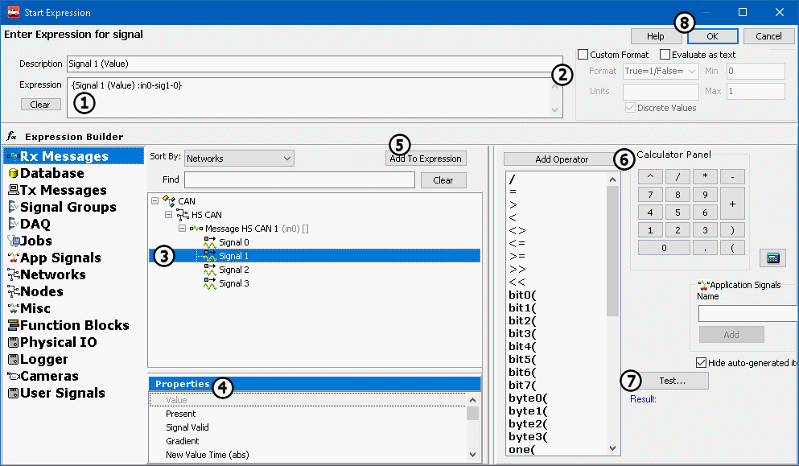

# Shared Features: Expression Builder

The Expression Builder is a handy feature that will be used again and again while working with Vehicle Spy. This user friendly dialog builds expressions for many tasks such as controlling Function Blocks, linking signals to Graphical Panel elements, and creating custom filters. The interface is constant throughout Vehicle Spy, so there is no burden of learning dozens of complicated dialogs. Just get familiar with the Expression Builder and that's it! Please refer to **Figure 1** below as the features of this dialog are explained further.

### Enter Expression Area:

Enter an equation directly into the Expression field at the top of the screen (Figure 1:). This field has a right click menu with standard editing features. Use **Evaluate as text** (located below the **Expression** field) for expressions containing only text, or a combination of text and pure data elements without operations performed on them. For example, the expression "The value of engine rpm is {Engine RPM :in1}" should have evaluate as text enabled. If an expression value will be displayed, use the **Custom Format** options (Figure 1:) to control its format and units, and min/max values.

### Expression Builder Area:

Vehicle Spy data sources are selected in the column on the far left. When a source is selected its data items will be displayed in tree form to its right (Figure 1:). When a data item is chosen its available properties are displayed just below the data item tree (Figure 1:). After you select an item and its property you can add it to the Expression field by clicking the **Add to Expression** button (Figure 1:). Create more complicated expressions using the **Add Operator** and **Calculator Pane**l functions (Figure 1:) or by typing in the **Expression field** directly. After your equation is complete, it can be tested by clicking the **Test** button (Figure 1:). The test result will display below. When you are finished building your expression, click the **Ok** button (Figure 1:) to return to the previous view.\
\
Note that similar to C/C++ or Visual Basic, Boolean type equations are false when they evaluate to zero and true otherwise.

### Data Sources, Data Items, Properties, & Operators:

The Expression Builder has many data sources, data items, properties, and operators. Use **Table 1** below as a navigation aid to jump to specific tables or related Help Topics.

**Table 1: Data Source Jump Table**

| Jump to Item/Property Table       | Jump to Help Topic       |
| --------------------------------- | ------------------------ |
| Rx Message & Database Properties  | Messages Editor/Database |
| Tx Message Properties             | Messages Editor          |
| Signal Properties                 | Message Signals          |
| Signal Group (Logging) Properties | Logging                  |
| DAQ Properties                    | VehicleScape DAQ         |
| Job Properties                    | Diagnostics              |
| Application Signal Data Items     | Application Signals      |
| Network Properties                | Networks                 |
| Node Properties                   | Source Nodes             |
| Misc Data Items                   | n/a                      |
| Function Block Properties         | Function Blocks          |
| MEP Properties                    | Memory Edit Protocol     |
| Physical IO Properties            | n/a                      |
| Logger (CoreMini) Properties      | CoreMini Logging         |
| Operators & Calculator Panel      | n/a                      |

Below, **Table 2** describes all of the different properties for the different data sources in the Expression Builder. Digital refers to a signal that can be on or off like a switch. Analog refers to a signal that can have many different values like Vehicle Speed.

**Table 2: Data Source Properties**

**Message Properties: Rx Messages, Database, Tx Messages (shared)**

|             Message Property            | Type    |                                                                                           Description                                                                                           |
| :-------------------------------------: | ------- | :---------------------------------------------------------------------------------------------------------------------------------------------------------------------------------------------: |
|                 Present                 | Digital |                                                                       Turns true when message is first present on the bus.                                                                      |
|              Present Toggle             | Digital |                                                                  Toggles True/False every time the message appears on the bus.                                                                  |
|            Update Rate (rel)            | Analog  |                                                                               Time between counts of this message.                                                                              |
|            Update Rate (abs)            | Analog  |                                                            Time this message appeared on the bus relative to when Vehicle Spy starts.                                                           |
|                Per Second               | Analog  |                                                                            Rate that the message appears on the bus.                                                                            |
|                  Count                  | Analog  |                                                                       Number of times that the message appears on the bus.                                                                      |
|               Change Count              | Analog  |                                                                       Returns the number of times the message has changed.                                                                      |
|                Start Time               | Analog  |                                                                         Time that the message first appeared on the bus.                                                                        |
|                 Min Time                | Analog  |                                                                               Minimum update rate for the message.                                                                              |
|                 Max Time                | Analog  |                                                                               Maximum update rate for the message.                                                                              |
|                Mean Time                | Analog  |                                                                                Mean update rate for the message.                                                                                |
|              Message Status             | Analog  |                                                                                  Status flags for the message.                                                                                  |
|              Message ArbID              | Analog  |                                                       ArbID of a CAN type message as listed in the Messages Editor Rx/Tx/Database tables.                                                       |
|            Message RTM Frame            | Digital |                                                                             True if the message was a remote frame.                                                                             |
|                Message PT               | Analog  |                                                                                     PT byte of the message.                                                                                     |
|               Message Trgt              | Analog  |                                                                                    Trgt byte of the message.                                                                                    |
|               Message Src               | Analog  |                                                                                     Src byte of the message.                                                                                    |
|              Message Length             | Analog  |                                                                         Number of data bytes in a single frame message.                                                                         |
|             Message B1 to B8            | Analog  |                                                                               Data bytes B1 to B8 of the message.                                                                               |
|              Message Xtd ID             | Digital |                                                                         True if message has an Extended Arbitration ID.                                                                         |
|            Message Is Tx Msg            | Digital |          True if the Rx message was transmitted by Vehicle Spy. Simplifies network gateway logic versus using Has Transmitted because wildcard filters are allowed only on Rx messages.         |
|         MultiFrame (MF) Complete        | Digital |                                                                             True if multiframe message completed ok.                                                                            |
|               Message Data              | Analog  |                                  Use this for efficient gateway functionality, but not for display purposes. Example: Msg1(Message Data) = Msg2(Message Data).                                  |
|      MultiFrame Flow Control Arb ID     | Analog  |                                                                    Arb ID of the flow control frame in a multiframe message.                                                                    |
|                Message BX               | Analog  |                                                       Message data byte BX, where X = index. (Index 0 = byte B1, index 1 = byte B2, etc.)                                                       |
| Received Transport Layer Payload Length | Analog  |                                                                          Number of data bytes in a multiframe message.                                                                          |
|        Transport Layer Error Flag       | Analog  |                                                                 Non zero values imply transport layer stack detected a problem.                                                                 |
|           Last Received Arb ID          | Analog  | Last received ArbID of a message in a Rx or Database table. This is typically the same value as Message ArbID, but not when wildcard "X" bitwise filters are being used in the Messages Editor. |

**Message Properties: Unique to Tx Messages**

|            Message Property            |   Type  |                                                                            Description                                                                            |
| :------------------------------------: | :-----: | :---------------------------------------------------------------------------------------------------------------------------------------------------------------: |
| Any Tx Msg property shared with Rx Msg |   n/a   | Click HERE to go to start of Rx Message properties. (Tx Msg properties shared with Rx Msgs are explained there. Properties unique to Tx Msgs are explained here.) |
|            Tx Msg Period Ms            |  Analog |                                                          Periodic rate for the message (in milliseconds).                                                         |
|         Tx Msg Periodic On-Off         | Digital |                                                        Periodic mode of the message (0-normal, 1-periodic).                                                       |
|             Has Transmitted            | Digital |                                                     Becomes true if the message is transmitted by Vehicle Spy.                                                    |

**Signal Properties: Rx Messages, Database, Tx Messages, DAQ, Jobs**

|    Signal Property   |   Type  |                                                Description                                                |
| :------------------: | :-----: | :-------------------------------------------------------------------------------------------------------: |
|         Value        |   Any   | Value AFTER the Messages Editor signal equation is applied. The signal type determines the property type. |
|        Present       | Digital |                          True if the message with the signal has been on the bus.                         |
|     Signal Valid     | Digital |                                    True if the signal valid is current.                                   |
|       Gradient       |  Analog |                       Change in value between the last two instances of the signal.                       |
| New Value Time (abs) |  Analog |                                  Time that the last signal was received.                                  |
|      Start Value     |  Analog |                                        Initial value of the signal.                                       |
|       Min Value      |  Analog |                                          Minimum value received.                                          |
|       Max Value      |  Analog |                                          Maximum value received.                                          |
|      Mean Value      |  Analog |                                     Mean value of the received signal.                                    |
|    Start Gradient    |  Analog |                                   Initial change in the signal's value.                                   |
|     Min Gradient     |  Analog |                                   Smallest change in the signal's value.                                  |
|     Max Gradient     |  Analog |                                   Largest change in the signal's value.                                   |
|     Mean Gradient    |  Analog |                              Mean value of the change in the signal's value.                              |
|       Raw Value      |  Analog |                        Value BEFORE the Messages Editor signal equation is applied.                       |

**Signal Group (Logging) Properties**

| Signal Group Property |   Type  |                                  Description                                 |
| :-------------------: | :-----: | :--------------------------------------------------------------------------: |
|       Is Logging      | Digital |          True only when the signal group is currently being logged.          |
|       Log Count       |  Analog |                 Number of lines logged for the signal group.                 |
|     Pre Log Count     |  Analog |            Number of lines collected in the pre-start log buffer.            |
|     Time Remaining    |  Analog | Time remaining in the currently active signal group logging event (seconds). |
|       Total Time      |  Analog |            Total time of the signal group logging event (seconds).           |

**DAQ Properties**

|      DAQ Property     |   Type  |              Description              |
| :-------------------: | :-----: | :-----------------------------------: |
|       Is Running      | Digital |     True when the DAQ is running.     |
|      Is Triggered     | Digital |    True when the DAQ is triggered.    |
| Number Msgs Collected |  Analog | Number of lines collected by the DAQ. |

**Job (Diagnostic) Properties**

|            Job Property           |   Type  |                            Description                            |
| :-------------------------------: | :-----: | :---------------------------------------------------------------: |
|             Is Running            | Digital |                   True while the job is running.                  |
|     Number Messages Collected     |  Analog |     Reports total number of messages received during the job.     |
|           Is Successful           | Digital |              True if the job completed successfully.              |
|         ECU Response Count        |  Analog |             Number of ECUs that responded to the job.             |
|           Total Time Abs          |  Analog |                Total time used to complete the job.               |
| Last 7F Sub Function Excluding 78 |  Analog |  Last negative response sub-function received that was not a $78. |
|       7F Count Excluding 78       |  Analog | Number of negative responses received excluding sub-function $78. |
|    7F count 78 Response Pending   |  Analog |    Number of negative responses received with sub-function $78.   |

**Application Signal Data Items**

|        Data Item        | Type |                                                                                          Description                                                                                         |
| :---------------------: | :--: | :------------------------------------------------------------------------------------------------------------------------------------------------------------------------------------------: |
| Application Signal Name |  Any | Value of the Application Signal. The data item type depends upon the application signal type. If the signal is in an array, use the index (starts at 0) to access elements within the array. |

**Network Properties**

|          Network Property         |   Type  |                                                                                                                                                                                                                  Description                                                                                                                                                                                                                 |
| :-------------------------------: | :-----: | :------------------------------------------------------------------------------------------------------------------------------------------------------------------------------------------------------------------------------------------------------------------------------------------------------------------------------------------------------------------------------------------------------------------------------------------: |
|               Count               |  Analog |                                                                                                                                                                                                      Number of messages for the network.                                                                                                                                                                                                     |
|                Rate               |  Analog |                                                                                                                                                                                                Number of messages per second for the network.                                                                                                                                                                                                |
|            Percent Use            |  Analog |                                                                                                                                                                                                Percent of network utilization for the network.                                                                                                                                                                                               |
|              Max Rate             |  Analog |                                                                                                                                                                                            Maximum number of messages per second for the network.                                                                                                                                                                                            |
|          Max Percent Use          |  Analog |                                                                                                                                                                                                  Maximum network utilization for a network.                                                                                                                                                                                                  |
|            Error Count            |  Analog |                                                                                                                                                                                                       Number of errors on the network.                                                                                                                                                                                                       |
|              Tx Count             |  Analog |                                                                                                                                                                                         Number of messages transmitted by Vehicle Spy on the network.                                                                                                                                                                                        |
|             Error Rate            |  Analog |                                                                                                                                                                                                  Number of errors per second on the network.                                                                                                                                                                                                 |
|              Tx Rate              |  Analog |                                                                                                                                                                                           Number of messages transmitted per second on the network.                                                                                                                                                                                          |
|           Tx Buffer Fill          |  Analog |                                                                                                                                                                              Number of messages in the transmit buffer of the connected hardware on the network.                                                                                                                                                                             |
|              Enabled              | Digital |                                                                                                                        Enables the network. Some networks cannot be enabled at the same time (ex: LIN2, ISO2, and CGI on FIRE). Assigning a 1 will enable the network and disable other networks that would conflict.                                                                                                                        |
|             Available             | Digital |                                                                                                                                                   Read as 1 if network is available on current hardware, 0 otherwise. Useful for CoreMinis designed to run on several different 3G devices.                                                                                                                                                  |
|         Fast Wakeup Enable        | Digital |                                                                                                                                
Enables Fast Wakeup (no missed messages) for the HSCAN or MSCAN networks. (CoreMini only) Note: neoVI hardware has more parasitic current draw when this is enabled.
                                                                                                                                |
|          Text API Enable          | Digital |                                                                                                                                                                                           Enables Text API on the selected network. (CoreMini only)                                                                                                                                                                                          |
|              Bitrate              |  Analog |     
Network bitrate in bits per second. Read value represents the current bitrate. Write to signal to change desired bitrate.  Valid values for CAN are: 20000, 33333, 50000, 62500, 83333, 100000, 125000, 250000, 500000, 800000, &#x26; 1000000.  Valid values for LIN, ISO9141, and UART are 39 to 10000000.  Valid values for CGI are 115200 and 625000.  Not applicable for any other network types.
    |
|        Auto Bitrate Enable        | Digital |                                                                                                                                                                        Set to 1 to enable auto bitrate. Only supported for "first" two CAN channels of any 3G device.                                                                                                                                                                        |
|         Wakeup Event Count        |  Analog |                                                                                                                                                                                       Number of wakeup events triggered by the network. (CoreMini only)                                                                                                                                                                                      |
|          CAN Tx Err Count         |  Analog |                                                                                                                                                                                                 Number of CAN transmit errors on the network.                                                                                                                                                                                                |
|          CAN Rx Err Count         |  Analog |                                                                                                                                                                                                 Number of CAN receive errors on the network.                                                                                                                                                                                                 |
|        CAN Controller Mode        |  Analog |                                                                                                                                                                 
Controller mode if network is CAN. 0 - Normal 1 - Disabled 3 - Listen Only 7 - Listen All
                                                                                                                                                                 |
|        CAN Transceiver Mode       |  Analog |                                                                                                                                                       
Transceiver mode if network is CAN. 0 - Auto 1 - On 2 - Off 3 - High Voltage (SWCAN) 4 - High Speed (SWCAN)
                                                                                                                                                      |
|            CAN TQ SEG1            |  Analog |                                                                                                                                                                             CAN time quanta for segment 1. Writing to this signal will change the Bitrate signal.                                                                                                                                                                            |
|            CAN TQ SEG2            |  Analog |                                                                                                                                                                             CAN time quanta for segment 2. Writing to this signal will change the Bitrate signal.                                                                                                                                                                            |
|            CAN TQ Prop            |  Analog |                                                                                                                                                                         CAN time quanta for propagation delay. Writing to this signal will change the Bitrate signal.                                                                                                                                                                        |
|              CAN Sync             |  Analog |                                                                                                                                                                    CAN time quanta for synchronization jump width. Writing to this signal will change the Bitrate signal.                                                                                                                                                                    |
|              CAN BRP              |  Analog |                                                                                                                                                                                CAN baud rate prescaler. Writing to this signal will change the Bitrate signal.                                                                                                                                                                               |
|              LIN Mode             |  Analog |                                                                                                                                                                         
Transceiver mode if network is LIN. 0 - Sleep 1 - Slow 2 - Normal 3 - Fast
                                                                                                                                                                        |
|        LIN Master Resistor        | Digital |                                                                                                                                                                                       
Set to 0 to enable, 1 to disable. (This is not a typo!)
                                                                                                                                                                                      |
|     K-Line Message Termination    | Digital |                                                                                                                   
Selects how the end of frame is determined if network is K-Line, ISO9141, or Keyword 2000. 0 = Inner Frame Time 1 = GME CIM-SCL (GM Europe Column Integration Module - Steering Column Lock)
                                                                                                                  |
|       K-Line Checksum Enable      | Digital |                                                                                                                                                     Set to 1 to enable auto appending the 8 bit checksum (byte sum of all bytes in frame). Also enables checksum validation in VSpy3/DLL.                                                                                                                                                    |
|   K-Line Rx Inner Frame Spacing   |  Analog |                                                                                                   
Value depends upon K-Line Message Termination:  If using Inner Frame Time: Value = 2 * P2 min ms (i.e. 50 = 2 * 25 ms)  If using GME CIM-SCL: Value = 10 * "t_InterMessage min" ms (i.e. 3 = 10 * 0.3 ms)
                                                                                                   |
|   K-Line Tx Inner Frame Spacing   |  Analog |                                                                                                     
Value depends upon K-Line Message Termination:  If using Inner Frame Time: Value = 2 * P3 ms (i.e. 110 = 2 * 55 ms)  If using GME CIM-SCL: Value = 10 * "Tx t_InterMessage" ms (i.e. 2 = 10 * 0.2 ms)
                                                                                                     |
|    K-Line Tx Inner Byte Spacing   |  Analog |                                                                                                         
Value depends upon K-Line Message Termination:  If using Inner Frame Time: Value = 2 * P4 ms (i.e. 10 = 2 * 5 ms)  If using GME CIM-SCL: Value = 10 * "t_InterByte" ms (i.e. 1 = 10 * 0.1 ms)
                                                                                                         |
|           K-Line Parity           |  Analog |                                                                                                                                                                   
Selects parity if network is K-Line, ISO9141, or Keyword 2000. 0 - None 1 - Even 2 - Odd
                                                                                                                                                                   |
|   K-Line Enable Tester Resistor   | Digital |                                                                                                                                                                          Set to 1 to enable 510 ohm tester resistor if network is K-Line, ISO9141, or Keyword 2000.                                                                                                                                                                          |
|        CGI Checksum Enable        | Digital |                                                                                                                                                                                             Set to 1 to enable 16 bit checksum if network is CGI.                                                                                                                                                                                            |
| CGI Rx Inner Frame Spacing (bits) |  Analog |                                                                                                                                                                                     Sets receive message inner frame spacing (in bits) if network is CGI.                                                                                                                                                                                    |
| CGI Tx Inner Frame Spacing (bits) |  Analog |                                                                                                                                                                                    Sets transmit message inner frame spacing (in bits) if network is CGI.                                                                                                                                                                                    |
|  SWCAN AutoSwitch Resistor Enable |  Analog |                                                                                                                                                         
Enables SWCAN high speed mode. 0 = Disabled 1 = Autoswitch no resistor 2 = Autoswitch with resistor (default)
                                                                                                                                                        |
|          UART Tx Register         |  Analog |                                                                                                                                                                                                     Stores data for transmitting on UART.                                                                                                                                                                                                    |
|          UART Tx Is Full          | Digital |                                                                                                                                                                                                   True if the UART transmit buffer is full.                                                                                                                                                                                                  |
|          UART Tx is Empty         | Digital |                                                                                                                                                                                                  True if the UART transmit buffer is empty.                                                                                                                                                                                                  |
|          UART Rx Register         |  Analog |                                                                                                                                                                                                        Stores data received from UART.                                                                                                                                                                                                       |
|          UART Rx is Full          | Digital |                                                                                                                                                                                                   True if the UART receive buffer is full.                                                                                                                                                                                                   |
|          UART Rx is Empty         | Digital |                                                                                                                                                                                                   True if the UART receive buffer is empty.                                                                                                                                                                                                  |
|        UART Rx Parity Error       | Digital |                                                                                                                                                                                                   True if a UART parity error is detected.                                                                                                                                                                                                   |
|        UART Rx Frame Error        | Digital |                                                                                                                                                                                                    True if a UART frame error is detected.                                                                                                                                                                                                   |
|       UART Rx Overflow Error      | Digital |                                                                                                                                                                                                  True if a UART overflow error is detected.                                                                                                                                                                                                  |
|         UART Rx Clear FIFO        | Digital |                                                                                                                                                                                              Clears the UART FIFO receive buffer when set to 1.                                                                                                                                                                                              |
|          UART Error Field         |  Analog | 
Reports the Error Status of UART communication  1 = UART_NET_ERROR_TX_MISMATCH Rx does not equal Tx 2 = UART_NET_ERROR_TX_TIMEOUT no Tx ISR 4 = UART_NET_ERROR_TX_FIFO_OVERFLOW Tx FIFO overflow detected 8 = UART_NET_ERROR_RX_FIFO_OVERFLOW Rx FIFO overflow detected 16 = UART_NET_ERROR_RX_PARITY Parity error 32 = UART_NET_ERROR_RX_OVERFLOW Hardware overflow 64 = UART_NET_ERROR_RX_FRAME frame error
 |

**Node** **Properties**

|     Node Property    |   Type  |                     Description                     |
| :------------------: | :-----: | :-------------------------------------------------: |
|         Count        |  Analog |           Number of messages for the node.          |
|         Rate         |  Analog |     Number of messages per second for the node.     |
|      Percent Use     |  Analog |     Percent of network utilization for the node.    |
|       Max Rate       |  Analog | Maximum number of messages per second for the node. |
|    Max Percent Use   |  Analog |       Maximum network utilization for a node.       |
|  NetMgmt Frame Count |  Analog |                         TBD                         |
| NetMgmt Is Simulated | Digital |                         TBD                         |

**Misc Data Items**

| Misc Data Item                                              | Type    | Description                                                                                                                                                                                                                                               |
| ----------------------------------------------------------- | ------- | --------------------------------------------------------------------------------------------------------------------------------------------------------------------------------------------------------------------------------------------------------- |
| 
<strong></strong>

<strong>GPS Items</strong>
   |         |                                                                                                                                                                                                                                                           |
| GPS Altitude, Latitude, Longitude, Speed                    | Analog  | GPS data values.                                                                                                                                                                                                                                          |
| GPS Valid                                                   | Digital | True if GPS data is valid.                                                                                                                                                                                                                                |
| 
<strong></strong>

<strong>Input Items</strong>
 |         |                                                                                                                                                                                                                                                           |
| Joystick 1-10                                               | Digital | True while corresponding joystick button 1-10 is pressed.                                                                                                                                                                                                 |
| Joystick XYZ                                                | Analog  | Current joystick x, y, z values ranging from 0-65535.                                                                                                                                                                                                     |
| Keyboard CTRL                                               | Digital | True while keyboard control key is pressed.                                                                                                                                                                                                               |
| Keyboard F6-F12                                             | Digital | True while corresponding keyboard F6-F12 key is pressed.                                                                                                                                                                                                  |
| neoVI PRO Buttons                                           | Digital | True while corresponding neoVI PRO button is pressed.                                                                                                                                                                                                     |
| 
<strong></strong>

<strong>Misc Items</strong>
  |         |                                                                                                                                                                                                                                                           |
| Available Disk Space (KB)                                   | Analog  | Amount of disk space available, in kilobytes, at the Vehicle Spy exe file location.                                                                                                                                                                       |
| Dropped Logged Sectors                                      | Analog  | Number of sectors dropped by the SD card logger.                                                                                                                                                                                                          |
| neoVI PRO Outputs                                           | Digital | Set true to activate the neoVI PRO LEDs, Backlight, Buzzer or invert its screen.                                                                                                                                                                          |
| Sector Buffers Remaining                                    | Analog  | 
Number of sector buffers remaining. (CoreMini only)  If the value is zero then there is no more buffering space for incoming messages. If you continue logging data you will cause a buffer overflow.
                                        |
| **Time Items**                                              |         |                                                                                                                                                                                                                                                           |
| Abs Time (Sec)                                              | Analog  | Absolute time since Vehicle Spy start button was pressed.                                                                                                                                                                                                 |
| Day                                                         | Analog  | Day of the month as set on the computer clock.                                                                                                                                                                                                            |
| Day of week                                                 | Analog  | Numbers 0-6 representing days of the week as set on the computer clock. 0=Sunday, 1=Monday, etc.                                                                                                                                                          |
| Hour                                                        | Analog  | Hour from 0-23 as set on the computer clock. 0=Midnight, 12=Noon, etc.                                                                                                                                                                                    |
| Minute                                                      | Analog  | Minute 0-59 as set on the computer clock.                                                                                                                                                                                                                 |
| Month                                                       | Analog  | Month 1-12 as set on the computer clock.                                                                                                                                                                                                                  |
| Second                                                      | Analog  | Second 0-59 as set on the computer clock.                                                                                                                                                                                                                 |
| Time (ms)                                                   | Analog  | Millisecond value from the Windows TimeGetTime API.                                                                                                                                                                                                       |
| Time Diff                                                   | Analog  | 
Provides highly accurate (0.5 - 25 usec) message timing measurement in CoreMini.  Basic script logic is: 1) Wait until both messages are present 2) Set TimeDiff = Msg2.AbsTime - Msg1.AbsTime 3) Set application signal = TimeDiff
 |
| Year                                                        | Analo   | 4 digit representation of the year as set on the computer clock.                                                                                                                                                                                          |

**Function Block Properties**

|  Function Block Property  |   Type  |                                 Description                                 |
| :-----------------------: | :-----: | :-------------------------------------------------------------------------: |
|         Is Running        | Digital | True when the function block is running. Works for any function block type. |
|        Is Triggered       | Digital |               True when a Capture function block is triggered.              |
|   Number Msgs Collected   |  Analog |          Number of messages collected by a Capture function block.          |
| Script Filter Add Message |  Analog |          Adds a message to a Capture function block script filter.          |

**MEP (Memory Edit Protocol) Properties**

| MEP Property | Type | Description                                                                                           |
| ------------ | ---- | ----------------------------------------------------------------------------------------------------- |
| Value        | Any  | Value of the MEP signal. The data item type depends upon the MEP signal type defined in the A2L file. |

**Physical IO Properties**

| Physical IO Property                | Type    | Description                                                                                                                                                                                                                                                                                                                                                                                                                                          |
| ----------------------------------- | ------- | ---------------------------------------------------------------------------------------------------------------------------------------------------------------------------------------------------------------------------------------------------------------------------------------------------------------------------------------------------------------------------------------------------------------------------------------------------- |
| **Analog Inputs**                   |         |                                                                                                                                                                                                                                                                                                                                                                                                                                                      |
| Analog Input 1-8                    | Analog  | Reads Analog inputs on supported neoVI devices.                                                                                                                                                                                                                                                                                                                                                                                                      |
| **Analog Outputs**                  |         |                                                                                                                                                                                                                                                                                                                                                                                                                                                      |
| Analog Output 1-10                  | Analog  | Sets the Analog outputs on supported neoVI devices.                                                                                                                                                                                                                                                                                                                                                                                                  |
| **General neoVI Hardware**          |         |                                                                                                                                                                                                                                                                                                                                                                                                                                                      |
| Ain Report Interval                 | Analog  | Report interval for analog inputs. (1 to 125 ms)                                                                                                                                                                                                                                                                                                                                                                                                     |
| Device Serial Number                | Analog  | Serial number of the neoVI hardware. (CoreMini only)                                                                                                                                                                                                                                                                                                                                                                                                 |
| L Line State                        | Digital | Sets the L line state.                                                                                                                                                                                                                                                                                                                                                                                                                               |
| LED Flash Type                      | Digital | TBD                                                                                                                                                                                                                                                                                                                                                                                                                                                  |
| LED Group                           | TBD     | TBD                                                                                                                                                                                                                                                                                                                                                                                                                                                  |
| Main Loop                           | Analog  | Duration (ns) of last main process loop in CoreMini.                                                                                                                                                                                                                                                                                                                                                                                                 |
| Main Loop Max                       | Analog  | Maximum duration (ns) of main process loop in CoreMini since power up.                                                                                                                                                                                                                                                                                                                                                                               |
| Power Off Timer                     | Analog  | Time (ms) since the last keep awake event occurred. (Rx msg, USB connect, etc.)                                                                                                                                                                                                                                                                                                                                                                      |
| Power Off Timer Reset               | Digital | Resets the Power Off Timer to 0.                                                                                                                                                                                                                                                                                                                                                                                                                     |
| Relay Group                         | TBD     | TBD                                                                                                                                                                                                                                                                                                                                                                                                                                                  |
| Separation Time Offset              | Analog  | TBD                                                                                                                                                                                                                                                                                                                                                                                                                                                  |
| Tx Write Index                      | Analog  | TBD                                                                                                                                                                                                                                                                                                                                                                                                                                                  |
| Tx Write Limit                      | Analog  | TBD                                                                                                                                                                                                                                                                                                                                                                                                                                                  |
| Temperature Deg C                   | Analog  | TBD                                                                                                                                                                                                                                                                                                                                                                                                                                                  |
| UART 1 Line State                   | TBD     | TBD                                                                                                                                                                                                                                                                                                                                                                                                                                                  |
| UART 2 Line State                   | TBD     | TBD                                                                                                                                                                                                                                                                                                                                                                                                                                                  |
| **LEDs**                            |         |                                                                                                                                                                                                                                                                                                                                                                                                                                                      |
| LED 1-10                            | Digital | Set true to activate the selected LED. For FIRE, Red, Yellow, and ValueCAN3 hardware LED 1 = red and LED 2 = green.                                                                                                                                                                                                                                                                                                                                  |
| **LIN States**                      |         |                                                                                                                                                                                                                                                                                                                                                                                                                                                      |
| LIN1-6 State                        | TBD     | TBD                                                                                                                                                                                                                                                                                                                                                                                                                                                  |
| **Misc IO**                         |         |                                                                                                                                                                                                                                                                                                                                                                                                                                                      |
| Misc IO 1-67 Value                  | Analog  | Sets or Reads the IO states for neoECU Chip.                                                                                                                                                                                                                                                                                                                                                                                                         |
| Misc IO 1-67 Is Output              | Digital | Sets the direction of IO on a neoECU Chip.                                                                                                                                                                                                                                                                                                                                                                                                           |
| **PWM Inputs**                      |         |                                                                                                                                                                                                                                                                                                                                                                                                                                                      |
| PWM Input 1-8 Value                 | Digital | Reads the Value of the Pulse to be sent for the duration sent with Pulse Width.                                                                                                                                                                                                                                                                                                                                                                      |
| PWM Input 1-8 PWM Frequency (Hz)    | Analog  | Reads the Frequency of neoECU Devices that support PWM IO                                                                                                                                                                                                                                                                                                                                                                                            |
| PWM Input 1-8 PWM Duty (%)          | Analog  | Reads the Duty cycle of neoECU Devices that support PWM IO                                                                                                                                                                                                                                                                                                                                                                                           |
| PWM Input 1-8 PWM Pulse Width (us)  | Ana     | Reads the Pulse Width of neoECU Devices that support PWM IO                                                                                                                                                                                                                                                                                                                                                                                          |
| PWM Input 1-8 PWM Timer Source      | Digital | 
Sets 16 bit timer source resolution for tracking pulse widths in firmware.  
<table><thead><tr><th>Timer Source</th><th>Time/Tick (firmware)</th><th>Max Pulse Width</th></tr></thead><tbody><tr><td>0</td><td>6.4 us</td><td>419.4304 ms</td></tr><tr><td>1</td><td>25 ns</td><td>1.638400 ms</td></tr></tbody></table>
 So, if pulses are wider than 1.6 ms use timer source value of 0. Firmware defaults timer source to 1.
 |
| **PWM Outputs**                     |         |                                                                                                                                                                                                                                                                                                                                                                                                                                                      |
| PWM Output 1-8 Value                | Digital | Sets the Value of the Pulse to be sent for the duration sent with Pulse Width.                                                                                                                                                                                                                                                                                                                                                                       |
| PWM Output 1-8 PWM Frequency (Hz)   | Analog  | Sets the Frequency of neoECU Devices that support PWM IO                                                                                                                                                                                                                                                                                                                                                                                             |
| PWM Output 1-8 PWM Duty (%)         | Analog  | Sets the Duty cycle of neoECU Devices that support PWM IO                                                                                                                                                                                                                                                                                                                                                                                            |
| PWM Output 1-8 PWM Pulse Width (us) | Analog  | Sets the Pulse Width of neoECU Devices that support PWM IO                                                                                                                                                                                                                                                                                                                                                                                           |
| PWM Output 1-8 PWM Timer Source     | Digital | 
Sets 16 bit timer source resolution for tracking pulse widths in firmware. 
<table><thead><tr><th>Timer Source</th><th>Time/Tick (firmware)</th><th>Max Pulse Width</th></tr></thead><tbody><tr><td>0</td><td>6.4 us</td><td>419.4304 ms</td></tr><tr><td>1</td><td>25 ns</td><td>1.638400 ms</td></tr></tbody></table>
So, if pulses are wider than 1.6 ms use timer source value of 0. Firmware defaults timer source to 1.
            |
| **Power Management**                |         |                                                                                                                                                                                                                                                                                                                                                                                                                                                      |
| Power Management Mode               | Analog  | 
 Sleep mode of the neoVI hardware. (CoreMini only) 0 - Normal Sleep, Manual 1 - Normal Sleep, Timed 2 - Fast Wakeup, Timed 3 - Fast Wakeup, Manual
                                                                                                                                                                                                                                                                             |
| Power Management Network Enables    | Analog  | If Fast Wakeup is enabled, determines which network is using it. 0 = none 1 = HSCAN only 2 = MSCAN only 3 = HSCAN and MSCAN                                                                                                                                                                                                                                                                                                                          |
| Power Management Timeout            | Analog  | Quiet time (ms) needed before going to sleep. (CoreMini only)                                                                                                                                                                                                                                                                                                                                                                                        |
| Power Off Timer                     | Analog  | Time (ms) since the last keep awake event occurred. (Rx msg, USB connect, etc.)                                                                                                                                                                                                                                                                                                                                                                      |
| Power Off Timer Reset               | Digital | Resets the Power Off Timer to 0.                                                                                                                                                                                                                                                                                                                                                                                                                     |
| **Power Supply**                    |         |                                                                                                                                                                                                                                                                                                                                                                                                                                                      |
| Power Supply Current                | Analog  | N/A                                                                                                                                                                                                                                                                                                                                                                                                                                                  |
| Power Supply Is On                  | Digital | Tells the state of the Power supply on device (CoreMini only)                                                                                                                                                                                                                                                                                                                                                                                        |
| Power Supply Voltage                | Analog  | Reads voltage supplied to neoVI Device. (CoreMini only)                                                                                                                                                                                                                                                                                                                                                                                              |
| **Relays**                          |         |                                                                                                                                                                                                                                                                                                                                                                                                                                                      |
| Relay 1-8                           | Digital | Sets Relays on neoECU devices                                                                                                                                                                                                                                                                                                                                                                                                                        |
| **Switches**                        |         |                                                                                                                                                                                                                                                                                                                                                                                                                                                      |
| Switch 1-8                          | Digital | Reads Switches on neoECU devices                                                                                                                                                                                                                                                                                                                                                                                                                     |
| **neoVI FIRE Misc**                 |         |                                                                                                                                                                                                                                                                                                                                                                                                                                                      |
| CGI Bitrate                         | Analog  | CGI network bitrate in bits per second (115200 or 625000). Read value represents the current bitrate. Write to signal to change desired bitrate.                                                                                                                                                                                                                                                                                                     |
| CGI Enable                          | Digital | Set to 1 to enable the CGI network and disable conflicting networks.                                                                                                                                                                                                                                                                                                                                                                                 |
| Logging Buffer Index                | Analog  | Index of currently selected partition in SDCARD, used in CoreMini logging.                                                                                                                                                                                                                                                                                                                                                                           |
| MISCIO Report Period                | Analog  | Report period (ms) of the input/output status message sent on the neoVI device virtual network.                                                                                                                                                                                                                                                                                                                                                      |
| Misc 3-6 Is Analog In               | Digital | Sets if that MISC IO channel is an analog input or not.                                                                                                                                                                                                                                                                                                                                                                                              |
| Network Swap                        | Digital | Swaps HSCAN and MSCAN when enabled. Useful for applying an HSCAN script to MSCAN. 0 = normal (Tx HSCAN will show Rx on HSCAN) 1 = swapped (Tx HSCAN will show Rx on MSCAN)                                                                                                                                                                                                                                                                           |
| **Logger (CoreMini) Properties**    |         |                                                                                                                                                                                                                                                                                                                                                                                                                                                      |
| Logger Property                     | Type    | Description                                                                                                                                                                                                                                                                                                                                                                                                                                          |
| Available Disk Space (kB            | Analog  | Amount of SD card memory available, in kilobytes, at the CoreMini script location.                                                                                                                                                                                                                                                                                                                                                                   |
| Dropped Logged Sectors              | Analog  | 
Number of sectors dropped by the SD card logger. 
                                                                                                                                                                                                                                                                                                                                                                                          |
| Is CoreMini                         | Digital | Reads as 1 if script is running in CoreMini, otherwise 0.                                                                                                                                                                                                                                                                                                                                                                                            |
| Logging Buffer Index                | Analog  | Index of currently selected partition in SDCARD, used in CoreMini logging.                                                                                                                                                                                                                                                                                                                                                                           |
| Sector Buffers Remaining            | Analog  | 
Number of sector buffers remaining. (CoreMini only)  If the value is zero then there is no more buffering space for incoming messages. If you continue logging data you will cause a buffer overflow.
                                                                                                                                                                                                                                   |

### Operators and Calculator Panel

There are many operators available in the Expression Builder. These are listed in **Table 3** below. An operator can be added by selecting it from the list and then clicking the **Add Operator** button. Numbers can be added to your equation with the **Calculator Panel** (Figure 1:). Operators and numbers can both be added by typing them directly into the Expression field.

**Table 3: Operators Available in the Expression Editor**

| 

+
 |                          Add                         |                  1+1 is 2                 |
| :-------------: | :--------------------------------------------------: | :---------------------------------------: |
|        -        |                       Subtract                       |                  1-1 is 0                 |
|        \*       |                       Multiply                       |                 3\*3 is 9                 |
|        /        |                        Divide                        |              10/3 is 3.333333             |
|        ^        |                       Exponent                       |                  3^2 is 9                 |
|        =        |                        Equals                        |                2=1 is False               |
|        >        |                     Greater Than                     |               5 > 3 is True               |
|        <        |                       Less Than                      |               5 < 3 is False              |
|        <>       |                     Not Equal To                     |              3 <> 32 is True              |
|        <=       |                 Less Than or Equal To                |               5 <= 5 is True              |
|        >=       |               Greater Than or Equal To               |               6 >= 5 is True              |
|     >>(Arg)     |        Shift all bits to the right Arg times.        |                8 >> 1 is 4                |
|     <<(Arg)     |         Shift all bits to the left Arg times.        |                8 << 2 is 32               |
|    bitX(Arg)    |         Returns True if a specific bit is one        |              bit1(3) is True              |
|    byteX(Arg)   |         Returns a byte of a multi-byte value         | 
byte0(256) is 0 byte1(256) is 1
 |
|     one(Arg)    |               Returns 1 if Arg is true               |               One(5=5) is 1               |
|       and       |                Logical and Bitwise AND               |          (2=1) And (3=3) is False         |
|        or       |                Logical and Bitwise Or                |           (2=1) Or (3=3) is True          |
|       not       |                Logical and Bitwise Not               |             Not (1=1) is False            |
|       xor       |                Logical and Bitwise Xor               |              1 Xor 255 is 254             |
|      rnd(1)     |        Returns a random number between 0 and 1       |     Rnd(1) is 0.234324 (or other num)     |
|     abs(Arg)    |                 Absolute Value of Arg                |                abs(-2) is 2               |
|     sin(Arg)    |                 Sine of Arg (radians)                |             sin(3.141593) is 0            |
|     cos(Arg)    |                Cosine of Arg (radians)               |            cos(3.141593) is -1            |
|     tan(Arg)    |               Tangent of Arg (radians)               |             tan(0.785398) is 1            |
|     log(Arg)    |               Natural logarithm of Arg               |           log(2) is 0.6931471805          |
|    log10(Arg)   |               10 Based logarithm of Arg              |              log10(100) is 2              |
|     exp(Arg)    | e (the base of natural logarithms) raised to a power |           exp(2) is 7.3890560989          |
|     sqr(Arg)    |                  Square root of arg                  |                sqr(49) is 7               |
|     int(Arg)    |                Integer portion of arg                |             int(3.12434) is 3             |
|       mod       |   Divide two numbers and return only the remainder   |              19 Mod 6.7 is 5              |
|   arcsin(Arg)   |               Arcsine of Arg (radians)               |               arcsin(0) is 0              |
|   arccos(Arg)   |              Arccosine of Arg (radians)              |           arccos(-1) is 3.141593          |
|   arctan(Arg)   |              Arctangent of Arg (radians)             |           arctan(1) is 0.785398           |
