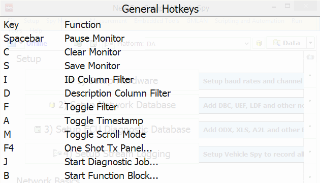
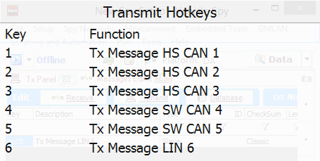

# Shared Features: Predefined Function Keys

Vehicle Spy comes with keyboard function keys F1 - F5 predefined with useful features as shown in Table 1.  The remaining keys F6 - F12 can be assigned to Vehicle Spy features like [Widgets](shared-features-widgets.md), Transmit Messages, [Diagnostic Jobs](../vehicle-spy-main-menus/main-menu-spy-networks/diagnostics/diagnostics-setup.md), and [Function Blocks](../vehicle-spy-main-menus/main-menu-scripting-and-automation/function-blocks/function-blocks-types/function-blocks-hotkeys.md) using their own hotkey pulldown lists.

| Function Key | Description                                                                                                 |
| ------------ | ----------------------------------------------------------------------------------------------------------- |
| F1           | Opens help file related to current window topic.                                                            |
| F2           | Starts/Stops [Vehiclescape DAQ](../vehicle-spy-main-menus/main-menu-measurement/vehiclescape-daq/) logging. |
| F3           | 
Opens General Hotkeys window - Figure 1. (use Esc to exit)
                                        |
| F4           | 
Opens Transmit Hotkeys window - Figure 2. (use Esc to exit)
                                       |
| F5           | [Starts/Stops Vehicle Spy](../vehicle-spy-main-menus/main-menu-run.md).                                     |

**Table 1: Predefined Function Keys in Vehicle Spy**

