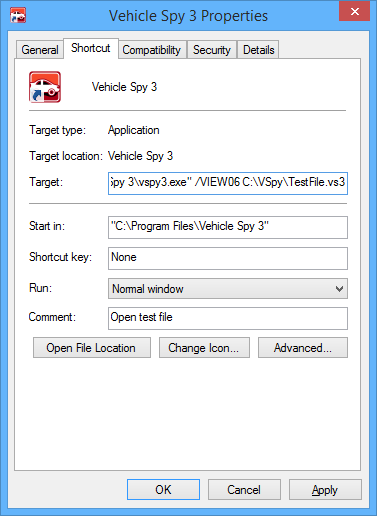

# Shared Features: Starting with a Selected View

Through the use of a command switch, a specified view can be displayed when Vehicle Spy starts. A use for this feature could be for an end-of-line tester where the end user only needs to interface with a graphical panel. Having only one view available prevents other aspects of Vehicle Spy file from being changed.

The command switch is setup using Windows Shortcut properties. Right click on a Vehicle Spy 3 shortcut and select properties. Changing the target from,\
"C:\Program Files\Vehicle Spy 3\vspy3.exe"\
to (where "XX" is the desired view),\
"C:\Program Files\Vehicle Spy 3\vspy3.exe" /VIEWXX\
will show the selected view and will prevent the user from changing the view. Adding the file name to open will open the specified file to the selected view.\
"C:\Program Files\Vehicle Spy 3\vspy3.exe" /VIEWXX c:\TestFileToOpen.vs3

Switch options are "/VIEWXX" to show a selected view in a windowed Vehicle Spy or "/FULLXX" to show a selected view in a full screen Vehicle Spy.

Values for XX are described below.

Scrolling Messages = 00\
Diagnostics Setup = 02\
Measurement Monitor =03\
Message Monitor = 04\
Graphical Panels = 06\
Function Blocks = 09\
GMLAN Diag ECUs = 11\
GMLAN Snapshot= 13\
Logging = 19\
Data Analysis = 29\
GMLAN Simulator = 30\
Main Logon = 40

