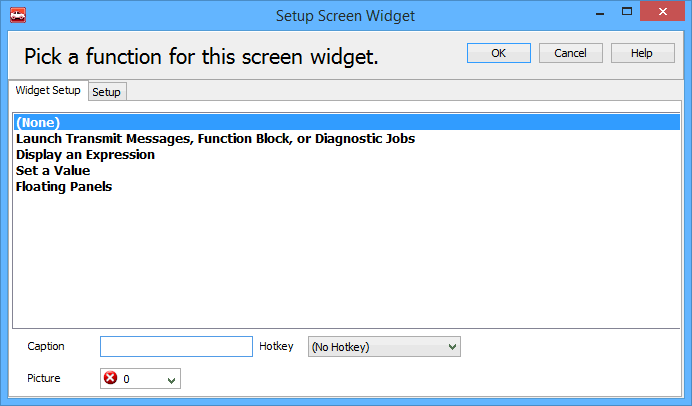
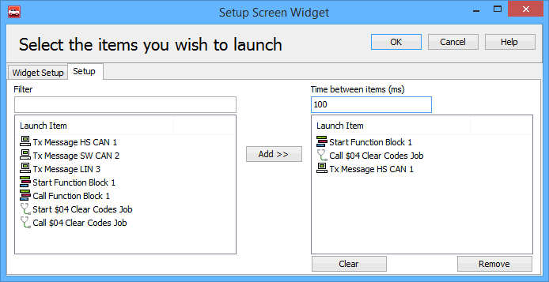
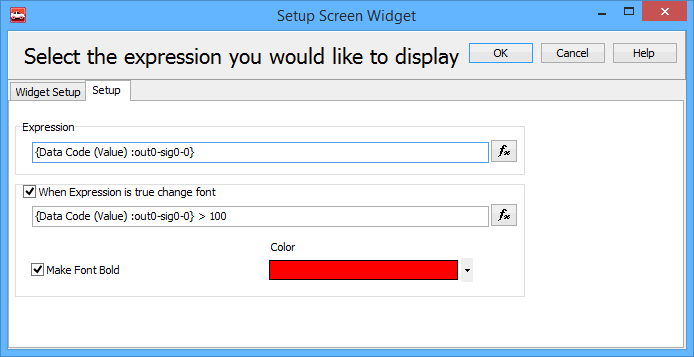

# Shared Features: Widgets

### Overview

Widgets in Vehicle Spy are handy programmable buttons (Figure 1) that can be activated with the mouse or keyboard. They can launch transmit messages, function blocks, and diagnostic jobs. Widgets can also display results of expressions or set values of variables.

### Widget Setup

To program a blank widget to do something, just left click on it to open the dialog shown in Figure 2. If you want to change a widget that has been previously programmed then right click on it instead and select Edit to get to the same setup dialog.

Use the first "Widget Setup" tab to select which action you want the widget to perform. A caption, hotkey, and icon can also be assigned to the widget here.

The second "Setup" tab will look different depending upon what action has been selected for the widget.

### Widget Setup to Launch Transmit Messages, Function Blocks, or Diagnostic Jobs

If this is the selected widget action then the Setup tab will look similar to Figure 3. All possible [transmit messages](../vehicle-spy-main-menus/main-menu-spy-networks/message-editor/messages-editor-receive-transmit-and-database-tables.md), [function blocks](../vehicle-spy-main-menus/main-menu-scripting-and-automation/function-blocks/), and [diagnostic jobs](../vehicle-spy-main-menus/main-menu-spy-networks/diagnostics/diagnostics-setup.md) that can be launched are shown on the left side. Use the Filter field to quickly find specific launch items in a long list. Double click an item in the list or use the Add>> button to add items to the widget action list on the right. Use the Clear and Remove buttons to clear the entire action list or remove one item at a time. One widget can support multiple launch items with a defined separation time between each item.

Function blocks and diagnostic jobs have both Start and Call actions. A Start action will start the item and then continue onto the next item (after waiting any specified time). A Call action will start the item, but wait for it to complete before continuing on to the next item.

### Widget Setup to Display an Expression

If the widget action is set to display an expression then the Setup tab will look similar to Figure 4.

Setup the Expression value to be displayed on the widget by clicking the fx button and using the [Expression Builder](shared-features-expression-builder.md). The widget display can also be setup to change its appearance based upon a true/false expression. Just enable the feature, build the expression, and choose the widget font characteristics that will appear whenever the expression is true.

### Widget Setup to Set a Value

Simply click the Expression fx button and use the [Expression Builder](shared-features-expression-builder.md) to build a widget that will set a value when its clicked.
