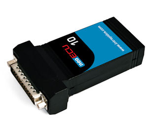

# neoECU 10

### Device Specifications

neoECU 10 can be purchased in one of two configurations;  HHL+ and HLSL+. The HHL+ version has two Dual wire CAN channels while the HLSL+ has one Dual wire CAN and a software selectable SW CAN or LSFT CAN channel.

* Operating Voltage- 6.0 to 26.5 DC
  * Multiple network support
    *   HHL+

        * 2 DW CAN channels (up to 1 M-Bit software selectable baud rate)
        * 1 LIN/ISO9141/KW2K

    * HLSL+
      * 1 DW CAN channel
      * 1 Software selectable SW CAN or LSFT CAN
      * 1 LIN/ISO9141/KW2K\

* Size: 2.2" x3.7"x 1"  Weight: 2 oz
* 5 User configurable LED
* 4 Analog inputs: 0 to 26.6 Volt (800K ohm)
* 6 PWM or Misc I/O. PWM outputs are Low side drivers.
* 4 Internal user available push buttons
* Custom power management

The pin connections for the 25 pin connector can be found on the sticker of the unit. Table 1 also has this listing. When working with a neoECU 10, the primary CAN network is HS CAN on pins 14 and 15. This is the network to use for configuring and loading scripts. For neoECU 10 HHL+, the second CAN Channel is found on pins 16 and 17. In Vehicle spy this is denoted as MS CAN.\
\
When working with an HLSL+ model, Pin 1 is used for SW CAN. Pins 3 and 4 are used for LSFT CAN. In Vehicle Spy, new messages are entered in under MS CAN. If you are using SW CAN or LSFT CAN, they still get entered in under MS CAN! More information on enabling these networks can be found on the [neoECU 10 IO Map topic](neoecu-10-io-map.md).

**Table 1: neoECU 10 Internal Switches**

| Pi | Name        |
| -- | ----------- |
| 1  | SW CAN      |
| 2  | Misc Wake   |
| 3  | LSFT CAN H  |
| 4  | LSFT CAN L  |
| 5  | PWM IO 1    |
| 6  | PWM IO 2    |
| 7  | Misc L      |
| 8  | LIN         |
| 9  | DBG CLK     |
| 10 | Analog In 1 |
| 11 | Analog In 2 |
| 12 | DBG Data    |
| 13 | PWR GND     |
| 14 | HS CAN H    |
| 15 | HS CAN L    |
| 16 | MS CAN      |
| 17 | MS CAN      |
| 18 | PWM IO 3    |
| 19 | PWM IO 4    |
| 20 | PWM IO 5    |
| 21 | PWM IO 6    |
| 22 | Analog In 3 |
| 23 | Analog In 4 |
| 24 | DBG RESET   |
| 25 | VBATT       |
