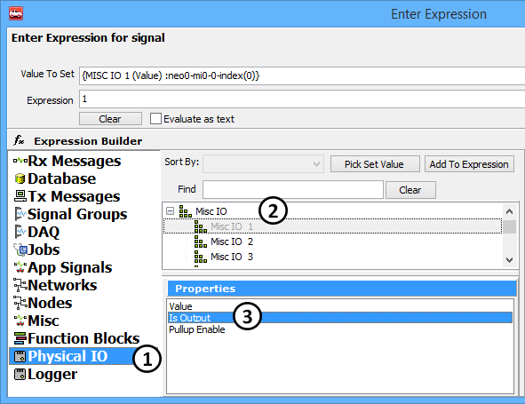
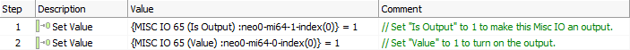

# neoECU 10: IO Map

The neoECU 10 uses Misc IO to configure the device.  Table 1 shows the Misc IO table for neoECU 10. Examples of using the Misc IO can be found at this Link: Examples. The examples show how to use different features like PWM I/O, Analog inputs, LED, SW CAN, and other configurations.

**Table 1: neoECU 10 Misc Pin**

| Misc IO Number | Name Of IO Controlled | Function of IO                           | Notes                                                                                       |
| -------------- | --------------------- | ---------------------------------------- | ------------------------------------------------------------------------------------------- |
| 7              | SW CAN M1             | Works with MISC IO 8 to set SW CAN State | Set is output to 1: For value use; Normal Misc 7=1 and Misc 8=1; HVWU Misc 7=1 and Misc 8=0 |
| 8              | SW CAN M0             | Works with MISC IO 7 to set SW CAN State | Set is output to 1: For value use; Normal Misc 7=1 and Misc 8=1; HVWU Misc 7=1 and Misc 8=0 |
| 9              | LSFT Enable           | Enables LSFT CAN                         | Set is output to 1: For value use; 1 for Enable, 0 to disable                               |
| 10             | LSFT \_STB#           | Enables LSFT CAN                         | Set is output to 1: For value use; 1 for Enable, 0 to disable                               |
| 15             | LSFT/SW\_EN#          | Enables LSFT and SW CAN                  | Set is output to 1: For value use; 1 for Enable, 0 to disable                               |
| 16             | LSFT/SW#\_SEL         | Enables LSFT CAN                         | Set is output to 1: For value use; 1 for LSFT, 0 for SW                                     |
| 32             | MISC IO2              | Controls MISC IO2                        | Set is output to 1: Value Sets Value                                                        |
| 33             | MISC IO1              | Controls MISC IO1                        | Set is output to 1: Value Sets Value                                                        |
| 45             | MISC IO3              | Controls MISC IO3                        | Set is output to 1: Value Sets Value                                                        |
| 46             | MISC IO4              | Controls MISC IO4                        | Set is output to 1: Value Sets Value                                                        |
| 47             | MISC IO5              | Controls MISC IO5                        | Set is output to 1: Value Sets Value                                                        |
| 48             | MISC IO6              | Controls MISC IO6                        | Set is output to 1: Value Sets Value                                                        |
| 50             | PWM2: IO6 On Device   | Is IO6 PWM                               | Set is output to 0: Value Sets 1=PWM, 0=MISCIO                                              |
| 51             | PWM3: IO5 On Device   | Is IO5 PWM                               | Set is output to 0: Value Sets 1=PWM, 0=MISCIO                                              |
| 52             | PWM4: IO4 On Device   | Is IO4 PWM                               | Set is output to 0: Value Sets 1=PWM, 0=MISCIO                                              |
| 55             | PWM5: IO2 On Device   | Is IO2 PWM                               | Set is output to 0: Value Sets 1=PWM, 0=MISCIO                                              |
| 57             | PWM7: IO3 On Device   | Is IO3 PWM                               | Set is output to 0: Value Sets 1=PWM, 0=MISCIO                                              |
| 58             | PWM8: IO1 On Device   | Is IO1 PWM                               | Set is output to 0: Value Sets 1=PWM, 0=MISCIO                                              |
| 65             | LED 3                 | Controls the state of LED 3              | Set is output to 1: Value Controls state                                                    |
| 66             | LED 2                 | Controls the state of LED 2              | Set is output to 1: Value Controls state                                                    |
| 67             | LED 1                 | Controls the state of LED 1              | Set is output to 1: Value Controls state                                                    |

The states and values for the MiscIO can be controlled though Function Blocks. The most common command to use to configure the Misc IO is Set Value.\
\
Figure 1 shows the Expression editor. To get to the Misc IO, select Physical IO on the left (Figure1: ) and then Misc IO to the right (Figure1: ). At the bottom there are three properties (Figure1: ). The "Value" option is used to set or read a value from that IO.  For example setting the value of an output, or reading the state of an input. The "Is Output" property is to set the direction of the IO. One reason for doing this would be setting the direction for the IO. For example if you are working with a Digital Output, you would set the "Is Output" property to 1 (output). If this IO is not an output, but an input, set this property to be 0 (input).\

One example of working with the Misc IO would be using the LED's. From Table 1, LED 3 is Misc IO 65. To work the LED, it would first need to be set to an output. In a Set Value command the "Is Output" Property would be set to "1".  This sets the direction of the IO. An LED is an output, so this IO was set to be an output. Next the "Value" property can be used to set the state of the LED. In the example below, the Value was set to 1 to turn the LED on.

