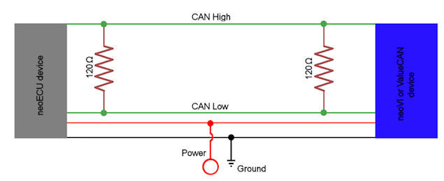
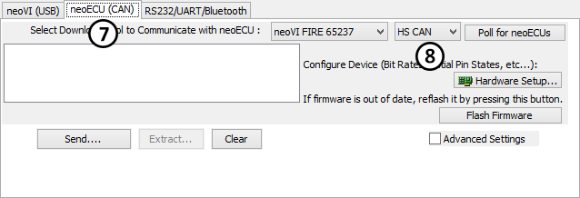

# neoECU 10: Loading Scripts Over CAN

Loading scripts into a neoECU device can be done in a few different ways. With neoECU 10, CAN is used to send the script to the device. For devices of this type, a CAN network and a CAN tool is needed to program them. Figure 1 shows an example network. The CAN tool can be a neoVI **FIRE**, neoVI RED, ValueCAN 3, and so on. The pin out for the CAN tool and the neoECU 10 can be found on the product's sticker.

### 1. CoreMini Console:

The first step to transferring a CoreMini to a neoECU device is to open the [CoreMini Console](../../../vehicle-spy-main-menus/main-menu-tools/utilities-coremini-console/). [CoreMini Console](../../../vehicle-spy-main-menus/main-menu-tools/utilities-coremini-console/) is found under Tools --> Utilities then CoreMini Console. Here, scripts can be loaded or removed from the hardware.

### 2. Using CoreMini Console:

The CoreMini Console contains information regarding the setup that is to be transferred. Figure 3:  shows the output list. This list will notify you of any errors or warnings. If problems exist in the script, a red dot will be next to that item to warn you that something is wrong. The section at the bottom labeled "Device Configuration and Download" lets you chose what type of CoreMini Device you are trying to access.

.gif>)

For CAN devices, click on "neoECU (CAN)" (Figure4: ). This works in much the same way with only a few exceptions. The first is that the CAN tool used to program the device needs to be selected (Figure4:).Once selected, the "Poll for neoECUs" can be clicked. This will fill the box on the right with the neoECU devices that were found. After the device is found, the Send and Clear buttons will send the script and clear the script.

