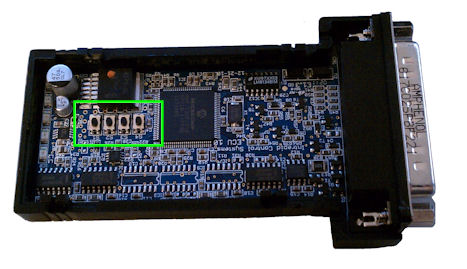

# neoECU 10: Power Up and Buttons

neoECU10 has four internal buttons (Figure 1). The buttons can be used with scripts or for setting power up conditions. Table 1 shows all four Power up conditions. The purpose of the power up conditions is to set the neoECU10 to a known state when there is a problem. An example would be not knowing the baudrate stored inside of the device. Using one of the buttons for a reset, would set a default baudrate inside the device so it could be connected to program again.

To activate the condition, hold that button while powering up the unit. Once the unit has powered up, the button can be released. Holding button 3 down while powering the neoECU10 has the same function as holding pin 2 to ground while powering the neoECU10

**Table 1: neoECU 10 Switches Actions**

| Switch   | Description                                                                                                    |
| -------- | -------------------------------------------------------------------------------------------------------------- |
| Switch 1 | Prevents neoECU from Automatically running the CoreMini Script                                                 |
| Switch 2 | Sets application settings to default states                                                                    |
| Switch 3 | Forces neoECU into Boot-Loader Mode (This can also be done by holding Pin 2 of the 25 pin connector to ground) |
| Switch 4 | Forces neoECU into Boot-Loader mode and sets application settings to default states                            |
