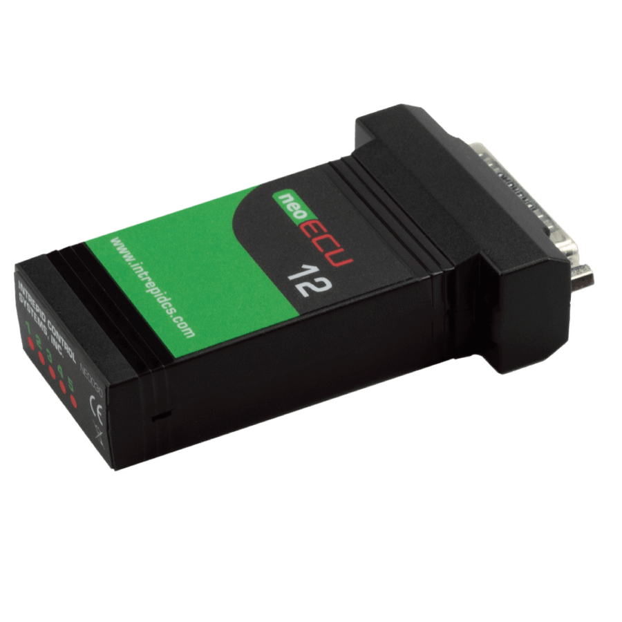

# neoECU 12

#### neoECU 12

Low-Cost Embedded ECU with CAN FD and Digital Input/Output

**Real-Time Real Fast ECU Development**\
\
Need a scriptable, low-cost node for CAN / CAN FD, and LIN? The neoECU 12 includes two CAN / CAN FD channels, LIN, analog In, PWM outputs and digital I/O. The node runs the Vehicle Spy CoreMini engine for easy setup.

<figure><figcaption>
neoECU 12
</figcaption></figure>

<table data-card-size="large" data-view="cards" data-full-width="true"><thead><tr><th></th><th></th><th></th><th data-hidden data-card-cover data-type="files"></th></tr></thead><tbody><tr><td></td><td></td><td></td><td><a href="../../.gitbook/assets/neoECU-12-connection.png">neoECU-12-connection.png</a></td></tr><tr><td><strong>Applications</strong>:</td><td>

<ul><li>Gateway nodes</li><li>Try out new algorithms early in the design process</li><li>Simulate a real ECU environment with dozens of low cost nodes</li><li>Integrate into ECU load or ECU test boxes to make them intelligent</li><li>Create custom test instruments</li><li>Convert CAN or LIN signals to analog and vice versa</li></ul></td><td></td><td></td></tr></tbody></table>

User Guide for neoECU 12 - [https://cdn.intrepidcs.net/guides/neoECU-12](https://cdn.intrepidcs.net/guides/neoECU-12/)
