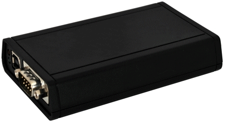

# neoECU 20

### Device Specifications

neoECU 20 is very similar in function to a neoVI FIRE.

### Device Specifications

* 3 DSPs and 1 RISC processor for 125 MIPS of processing
* Power Consumption (typical) : 150mA @ 14.4 VDC
* Sleep Power Consumption (typical) : 12mA @ 12.0 VDC
* Power Supply: 6-27 Volt Power Operation
*
* Dual user notification LED (red and green)
* Temperature Range: -40C to +85C
* Vehicle Connectors : 25 Pin male D-SUB and 9 Pin Male D-SUB
* Warranty: One Year Limited Warranty
* Firmware: Field upgradeable design (flash firmware)
* General Purpose IO: 6 MISC IO (0 - 3.3V), 4 IO can be configured as analog
* General Purpose IO rate report interval: 10 Hz to 1 kHz or based on digital change
* Stand-Alone Mode Including Scripting, Receive Messages, Transmit Messages, Expressions, IO, and Transport Layers

### Networks - General

* 64 Bit time stamping to accuracy of 10 microseconds on CAN and LIN networks and never overflows. 0.5 microsecond accuracy timestamp available if using one network only
* Simultaneous operations on all CAN/LIN/J1850 networks
* Transmit message double-buffering on all networks allows back to back message transmission

### Network Specifications

### 6x CAN Channels

* 4 Dedicated ISO11898 Dual Wire CAN Physical Layer (TJA1040)
* 1 Dedicated ISO11519 Low Speed Fault Tolerant CAN Physical Layer (TJA1054A)
* 1 Dedicated Single Wire CAN Physical Layer GMW3089 / SAE J2411 (MC33897) CAN 2.0B Active
* Up to 1 M-Bit Software Selectable Baud Rate (auto baud capable)
* Graphical Bit Time / Baud Rate Calculator
* Listen only mode support
* High Speed Mode, Test Tool Resistor, and High Voltage Wakeup support

### 4x LIN (Local Interconnect), ISO9141, Keyword 2000, or K and L Line

* Full support for LIN 1.X, 2.X and J2602
* LIN J2602 / 2.X compatible physical layer
* Software enabled 1K LIN Master Resistor PER CHANNEL
* Capable of Generating LIN Waveforms (Including Errors) Using Dedicated Output Compare Hardware (With firmware update)
* LIN Bus Monitor Mode identifies errors: Sync Break Error State and Length, Sync Wave Error, Message ID parity, TFrameMax/Slave Not Responding, Checksum Error and Transmit Bit Errors.
* LIN Bus Master Mode operates at same time as LIN Bus Monitor
* LIN Bus Slave simulation - with or without an LDF file
* LIN Bus hardware schedule table with support for LIN diagnostics
* UART Based State Machine
* only first channel supports L
* Programmable Timing Parameters including Inter-Byte, TX Inter-Frame, RX Inter-Frame and Initialization Waveforms (0.5 ms Resolution)
* Initialization Waveforms including Fast Init, Five Baud, and Custom
* Software Selectable Baud Rate
* Software enabled 512K Resistor (channel one only)

### 1x J1850 VPW (GM Class 2)

* VPW Physical Layer capable of TX and RX operations (MC33390)
* Reception of IFR data during TX and RX

### 1x GM CGI

* Software Enabled (disables LIN2)
* Programmable Bit Rate (625K, 115.2K, others)
* Full block mode message reception only
* Transmission Option available in CGI Simulation Toolkit

**Table 1: neoECU 20 device pinout**

| Pin | Name                | Description                                  |
| --- | ------------------- | -------------------------------------------- |
| 1   | SW CAN              | Single Wire CAN                              |
| 2   | J1850 VPW           | J1850 VPW (Class 2)                          |
| 3   | LSFT CAN H          | Low Speed Fault Tolerant CAN High            |
| 4   | LSFT CAN L          | Low Speed Fault Tolerant CAN Low             |
| 5   | MS CAN H            | Medium Speed CAN High                        |
| 6   | MS CAN L            | Medium Speed CAN Low                         |
| 7   | ISO L               | UART/ISO9141/Keyword Line "L"                |
| 8   | ISO K/LIN 1         | UART/ISO9141/Keyword Bi-directional Line "K" |
| 9   | DBG CLK             | Not Used                                     |
| 10  | MISC 1              | Miscellaneous Signal 1                       |
| 11  | MISC 2              | Miscellaneous Signal 2                       |
| 12  | DBG Data            | Not Used                                     |
| 13  | PWR GND             | Electrical Ground                            |
| 14  | HS CAN H            | High Speed CAN High                          |
| 15  | HS CAN L            | High Speed CAN Low                           |
| 16  | HS CAN 2 H          | High Speed CAN 2 High                        |
| 17  | HS CAN 2 L          | High Speed CAN 2 Low                         |
| 18  | MISC 4              | Miscellaneous Signal 4                       |
| 19  | HS CAN 3 H          | High Speed CAN 3 High                        |
| 20  | HS CAN 3 L          | High Speed CAN 3 Low                         |
| 21  | TSYNC CLK H / CGI H | CGI High                                     |
| 22  | TSYNC CLK L / CGI L | CGI Low                                      |
| 23  | MISC 3              | Miscellaneous Signal 3                       |
| 24  | DBG RESET           | Not Used                                     |
| 25  | VBATT               | Electrical Positive Supply 6-27 VDC          |

**Table 2 - neoECU 20, 9 pin Connector Pin Descriptions**

| Pin | Name      | Description            |
| --- | --------- | ---------------------- |
| 1   | LIN 1     | LIN 1                  |
| 2   | LIN 2     | LIN 2                  |
| 3   | LIN 3     | LIN 3                  |
| 4   | LIN 4     | LIN 4                  |
| 5   | GND       | Ground Reference       |
| 6   | MISC 5    | Miscellaneous Signal 5 |
| 7   | MISC 6    | Miscellaneous Signal 6 |
| 8   | NC        | No Connect             |
| 9   | VBatt Out | No Connect             |
