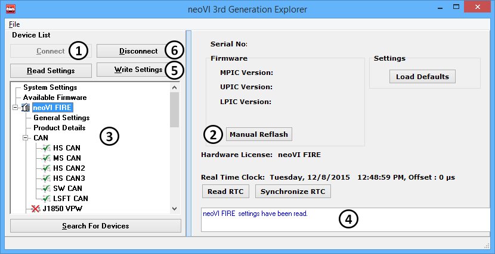

# neoECU 20: Configuration

neoECU 20 can be configured directly in neoVI 3G Explorer. neoVI 3G Explorer can be accessed in Vehicle Spy 3 by pressing the  button found just under the main menu, or selecting Hardware from the Setup menu.\
\
Once in neoVI 3G Explorer, the same steps used to configure a neoVI or ValueCAN device can be applied. Connect to the device using the Connect button (Figure 2: ). Like other any other neoVI or ValueCAN device, the device should do a firmware updated if needed. If Auto update is disabled this can be done manually using the Manual Reflash button. (Figure 2: ). Features of the device can be changed from the list on the left (Figure 2: ). The write settings button (Figure 2: ) will send the configured settings to the device. If there are any conflicts, the output window will list the problems (Figure 2: ). To finish, click on Disconnect (Figure 2: ).

