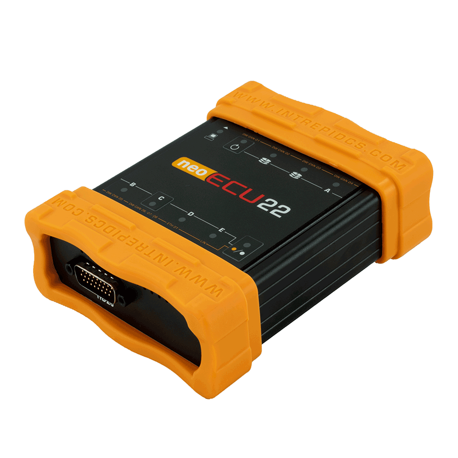

# neoECU 22

The neoECU 22 is a rapid prototyping tool for CAN, CAN FD, LIN and Ethernet. The neoECU 22 can be scripted to gateway, control and measure automotive network traffic and PDUs in minutes. Logic can be defined in Vehicle Spy’s Function Block scripts, or embedded C code, allowing you to keep your project moving.

<figure><figcaption>
neoECU 22
</figcaption></figure>

#### Applications&#x20;

* Create gateways in minutes with Vehicle Spy’s Enterprise’s Gateway Builder Feature. Gateway between CAN FD, CAN, LIN, and Ethernet
* Integrate into benches to replace or in advance of receiving a prototype ECU
* Simulate a real ECU environment with dozens of low cost nodes
* Try out new algorithms early in design

#### Features

* 8x DW CAN / CAN FD channels  &#x20;
* 8x software enabled CAN terminations&#x20;
* 2x LIN channels
* 1x DoIP Activation line
* 2x Gigabit Ethernet (1000BASE-T) for use with DoIP, XCPoE and more&#x20;
* Intrepid Security Module provides hardware cybersecurity support and embedded C Code capability&#x20;
* 10x Programmable tri-color LEDs&#x20;
* 2x full-size SD cards for scripting and playback
* Membrane LEDs to show link, error, and activity status&#x20;
* Vehicle battery level wakeup

User Guide for neoECU 22 - [https://cdn.intrepidcs.net/guides/neoVI-documentation](https://cdn.intrepidcs.net/guides/neoVI-documentation/index.html)
