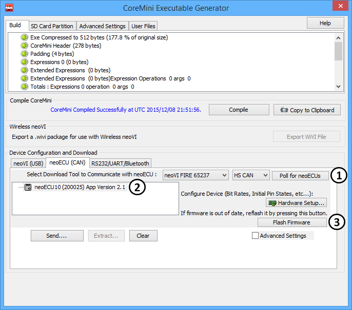

# neoECU Firmware Updates

The firmware in a neoECU can be upgraded. The firmware for the device is stored inside of Vehicle Spy. When loading a CoreMini to the device it is very important to make sure the firmware matches the version of firmware Vehicle Spy has in it. For USB neoECU devices, this can be verified and updated in neoVI 3G Explorer.\
\
For CAN type neoECU devices, open up the [CoreMini Console](../../vehicle-spy-main-menus/main-menu-tools/utilities-coremini-console/) (found under Tools --> Utilities then CoreMini Console). Click on "Poll for neoECUs" (Figure1: ). When the device is found, it will also display the "App Version" (Figure1: ). If necessary, use the "Flash Firmware" button (Figure1: ) to flash the firmware.

