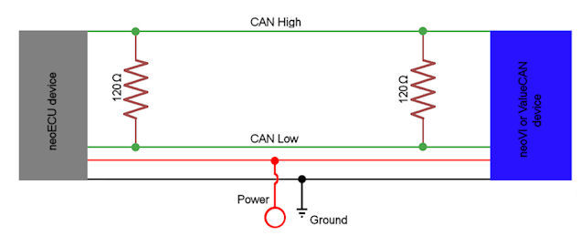

# neoECU Requirements

Below are the requirements for properly using and developing with the neoECU devices.

* neoECU Device: This could be neoECU 10, neoECU 20, or other neoECU device\

* Vehicle Spy 3 Pro: Vehicle Spy 3 is used to develop, test, and scripts\

* Power: 6 to 26 volts to power the neoECU

If you are using a neoECU 10 or a neoECU device that is programmed over CAN, the following is also needed

* An Intrepid Control Systems CAN tool: This can be a neoVI **FIRE**, neoVI RED, ValueCAN 3, and so on. This will be used to send the Script (CoreMini) to the device. The pin out for Intrepid hardware can be found on the sticker on the box.\

* Terminated CAN network:  If needed this can be built.  Two 120 ohm resistors can be used to terminate the network. Figure 1 shows how to make a simple CAN network that can be used to program CAN based neoECU devices.

