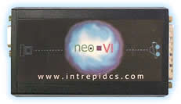

# Vehicle Network Interface Hardware: neoVI Blue

The neoVI Blue Vehicle Interface from Intrepid Control Systems supports all of the following networks: Dual Wire CAN, Low Speed Fault Tolerant CAN, Single Wire CAN, J1850 VPW, J1850 PWM, J1708, and UART based Keyword 2000 / ISO9141 / LIN.

All neoVI Blue setup is done through the neoVI Explorer.

