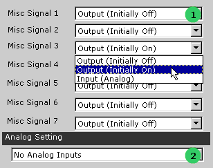
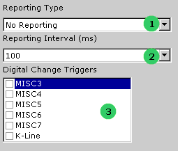

# General Purpose IO

### Applies to neoVI Blue

neoVI has six general purpose 5 VDC IO pins. These are labeled as MISC signals on the neoVI connector. These pins can be used for controlling or monitoring external devices.

### Basic Setup

The general purpose IO are setup in the neoVI explorer. The general IO tree node is shown in figure 1. On the panel you can setup the direction, type, and initial state of each IO pin. Each MISC signal has a dropdown box (figure 1 : bubble 1). In this drop down box you can set if the MISC pin is an input, an output initially off, or an output initially on. The outputs are capable of LED drive through a current limiting resistor. The maximum current of all outputs should not exceed 50 mA. For protection, each IO pin has a series 100 ohm resistor and a transient protection device.

### Analog Inputs

If setup as input, MISC pins 3 through 4 can be setup as analog inputs. You can setup analog inputs via the "Analog Setting" drop down (figure 1 : bubble 2). The settings are : 1) no analog inputs, 2) analog input on MISC 3, and 3) analog inputs on MISC 3-6. When setup for MISC3, the sampling rate will be once per millisecond. If the setting is for MISC3-6, the sample rate will be every four milliseconds. When using the MISC3-6 settings you can set an MISC3-6 pin for output. When you do this the pins output state will be sampled.

### General IO Reporting

You can setup the general IO to be automatically reported to the host in neoVI explorer (figure 2). You can setup the general IO to be reported at an interval or based on digital inputs changing (figure 2 : bubble 1). The report will be sent to the host as a neoVI Device Virtual Network message. When reporting based on interval is selected you can select the interval from the drop down box shown in bubble 2 in figure 2. You can select an interval from 1 to 125 ms. If you selected a report based on digital change, you can select both an interval the inputs are tested (figure 2 : bubble 2) and which digital inputs to test (figure 2 : bubble 3). You can select as many as are listed. The report based on digital change will "de-bounce" the reading by testing the inputs twice. Each test will occur at one-half the time interval.

