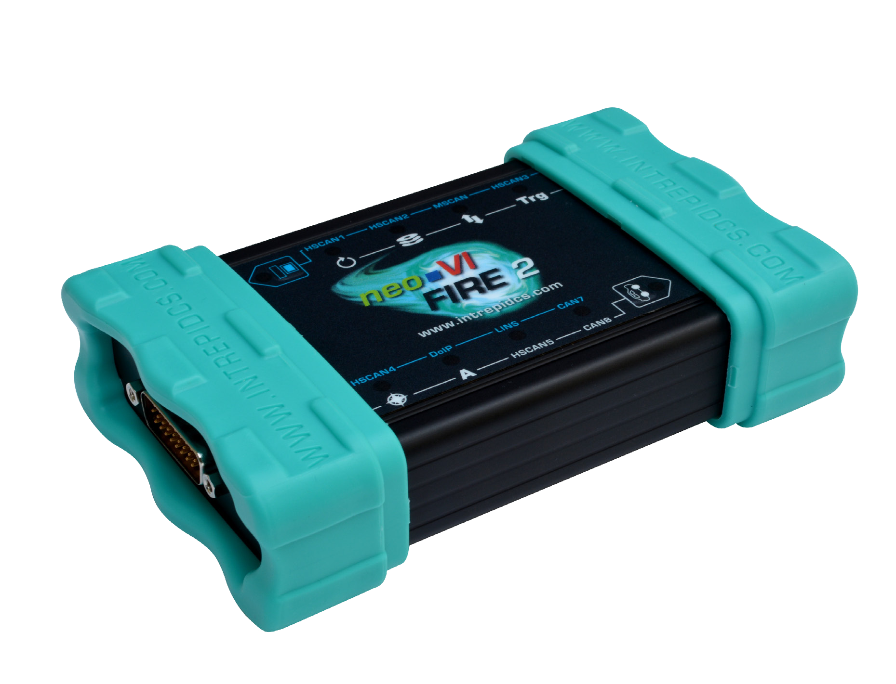

# Vehicle Network Interface Hardware: neoVI FIRE 2

**neoVI FIRE 2: 8x CAN FD, 4x LIN, Ethernet:DoIP/XCP**

Modern vehicle architectures are expanding to include Ethernet and CAN FD in addition to existing CAN and LIN networks. The neoVI FIRE 2 provides Ethernet, eight channels of CAN (including CAN FD) and four channels of LIN in one tool. All channels run simultaneously and are time-stamped in hardware. A fully-isolated high-speed USB interface allows messages to be sent and received without risk of damage to the PC.\

\

<figure><figcaption>
<strong>neoVI FIRE 2</strong>
</figcaption></figure>

neoVI FIRE 2 User Guide - [https://cdn.intrepidcs.net/guides/neoVI-Fire2/](https://cdn.intrepidcs.net/guides/neoVI-Fire2/)
