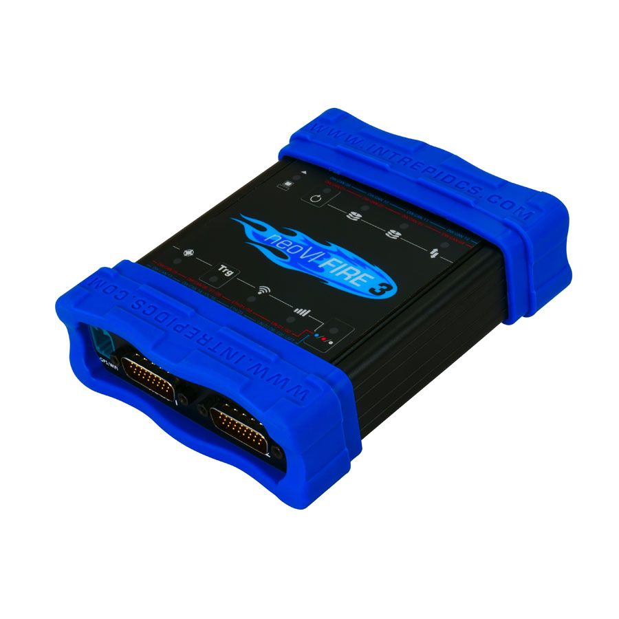

# Vehicle Network Interface Hardware: neoVI FIRE

#### **neoVI FIRE 2**&#x20;

**8x CAN FD, 4x LIN, Ethernet:DoIP/XCP**

Modern vehicle architectures are expanding to include Ethernet and CAN FD in addition to existing CAN and LIN networks. The neoVI FIRE 2 provides Ethernet, eight channels of CAN (including CAN FD) and four channels of LIN in one tool. All channels run simultaneously and are time-stamped in hardware. A fully-isolated high-speed USB interface allows messages to be sent and received without risk of damage to the PC.\

neoVI FIRE 2 User Guide - [https://cdn.intrepidcs.net/guides/neoVI-Fire2/](https://cdn.intrepidcs.net/guides/neoVI-Fire2/)

#### neoVI FIRE 3

**Vehicle Network Interface plus Data Logging System with CAN FD and Ethernet**

16x CAN FD, 8x LIN, 3x Ethernet Interfaces

The neoVI FIRE 3 is the most advanced multi-protocol vehicle network interface and data logger available. The neoVI FIRE 3 has 16x CAN FD networks, up to 8x LIN networks, 2x 1 Gb 10/100/1000BASE-T, 1x 10/100BASE-Tx.

All networks run simultaneously and are hardware time-stamped. A fully isolated high-speed ethernet interface allows messages to be sent and received without risk of damage to the networks or your computer.

<figure><figcaption>
neoVI FIRE 3 device
</figcaption></figure>

neoVI FIRE 3 User Guide - [https://cdn.intrepidcs.net/guides/neoVI-documentation](https://cdn.intrepidcs.net/guides/neoVI-documentation)
