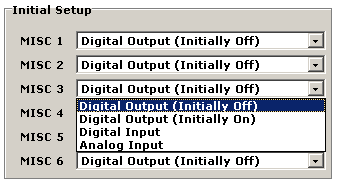
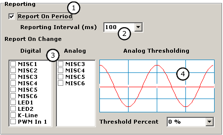

# General Purpose IO

### Applies to neoVI Red and neoVI FIRE

### Overview

neoVI has six general purpose 3.3 VDC IO pins. These are labeled as MISC signals on the neoVIconnector These pins can be used for controlling or monitoring external devices.

### Basic Setup

The MISC IO are setup in the neoVI 3G Explorer. Figure 1 shows the input output configuration. This is done by selecting Initial Values under MISC IO from the tree. On the panel shown, you can setup the direction, type, and initial state of each IOpin.

The outputs are capable of LED drive through a current limiting resistor. The maximum current of all outputs should not exceed 5 mA. For protection, each IO pin has a series 47 ohm resistor and a transient protection device.

### Analog Inputs

MISC pins 3 through 6 can be setup as analog inputs. To enable an analog input, you can select "Analog inputs" from the "Initial Setup" window.

### General IO Reporting

You can setup the general IO to be automatically reported to the host in neoVI 3G Explorer (figure 2) You can setup the general IO to be reported at an interval or based on digital inputs changing (figure 2 : bubble 1). The report will be sent to the host as a neoVI Device Virtual Network message.

When reporting based on interval is selected you can select the interval from the drop down box shown in bubble 2 in figure 2. You can select an interval from 1 to 125 ms.

If you selected a report based on digital change, you can select both an interval the inputs are tested (figure 2 : bubble 2) and which digital inputs to test (figure 2 : bubble 3). You can select as many as are listed.

