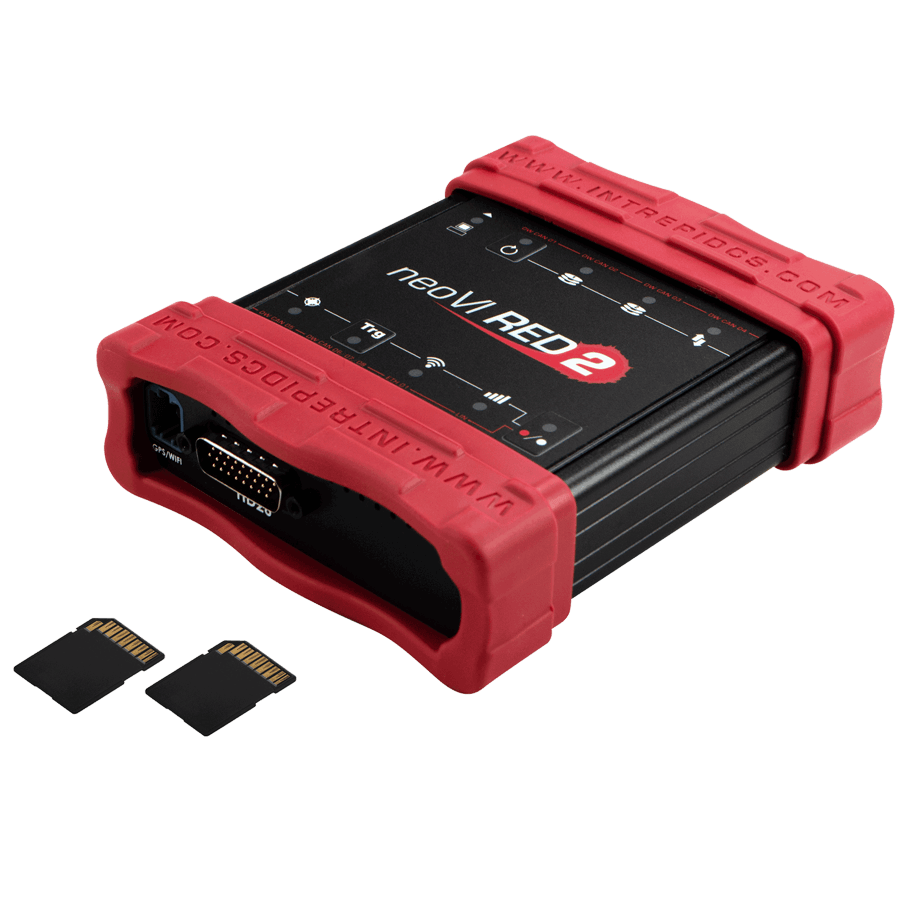

# Vehicle Network Interface Hardware: neoVI RED 2

#### Vehicle Network Interface and Data Logger for CAN FD, LIN & 1Gb Ethernet (DoIP/XCP)&#x20;

The neoVI RED 2 combines the best of vehicle network interfaces with the Linux-embedded operating system. The result is a solution unparalleled in capability with support for multiple network interfaces and standalone logging.&#x20;

The neoVI RED 2 Series has up to eight dual wire CAN FD channels, two LIN channels, and two Gigabit Ethernet channels. The neoVI RED 2 fills the need for multiple protocol tools with a low-cost, high-value vehicle bus interface that fits in your backpack.

<figure><figcaption>
<strong>Overview of the neoVI RED 2</strong>
</figcaption></figure>

Now available in three different configurations (adjustable via firmware):

* neoVI RED 2-8 – 8x CAN/CAN FD, 2x LIN with 8x software enable CAN termination&#x20;
* neoVI RED 2-4 – 4x CAN/CAN FD, 2x LIN with 4x software enable CAN termination
* neoVI RED 2-2 – 2x CAN/CAN FD, 2x LIN with 2x software enable CAN termination

neoVI RED 2 User Guide - [https://cdn.intrepidcs.net/guides/neoVI-RED2/index.html](https://cdn.intrepidcs.net/guides/neoVI-RED2/index.html)
