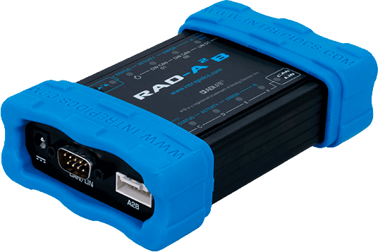

# Vehicle Network Interface Hardware: RAD-A2B

#### Automotive Audio Bus and Network Monitoring Solution

Intrepid has partnered with Analog Devices to create a state-of-the art A2B (Automotive Audio Bus®) testing tool. A2B technology allows a two-Wire interface to transmit audio and control data using a multi-source audio system. This technology enables low cost transmission of audio, active noise cancellation and in-vehicle voice recognition from any part of the vehicle.

RAD-A2B combines Analog Devices’ A2B technology with two CAN/CAN-FD transceivers and one LIN channel to allow mixed network messages in one time stamped log. The RAD-A2B tool includes one channel for A2B receive-only monitoring and one channel that can act as an emulator node.

The A2B tool works in harmony with the Intrepid Controls world renowned Vehicle Spy application. In Vehicle Spy, you can view A2B live data, control frames, I²C data, real-time audio meters for visual reference, and the ability to capture streams. When used as an emulator node, full A2B node simulation including downstream flashing is allowed (available with future update).

<figure><figcaption>
RAD-A2B device
</figcaption></figure>

User Guide for RAD-A2B - [https://cdn.intrepidcs.net/guides/RAD-A2B/](https://cdn.intrepidcs.net/guides/RAD-A2B/)
