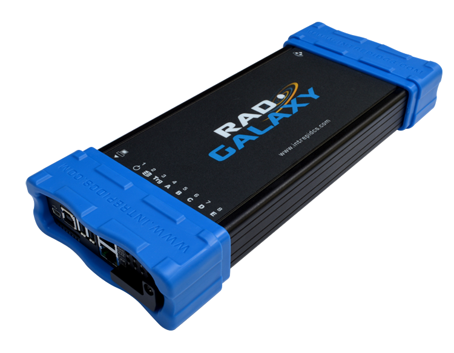

# Vehicle Network Interface Hardware: RAD-Galaxy

#### **Your Go-To Tool for Conventional and Next-Generation Vehicle Networks**

Intrepid’s RAD-Galaxy is a multi-purpose Ethernet active tap and media converter for Automotive Ethernet. Using the RAD-Galaxy, you can monitor both sides of up to 6 BroadR-Reach® (100BASE-T1) connections, or attach your laptop to as many as 12 BroadR-Reach® ECUs or other devices. As a gateway to standard 8-wire Gigabit Ethernet, RAD-Galaxy makes any standard Ethernet device, laptop, or data logger compatible with BroadR-Reach®.

The RAD-Galaxy has 12 BroadR-Reach / 100BASE-T1 PHYs, allowing it to tap 6 links between ECUs and/or switch ports. It can also be configured to act as a media converter for up to 12 devices. In addition to its Automotive Ethernet capabilities, it offers 8x CAN FD channels, 1 LIN channel, DoIP support and standalone operation capability.

<figure><figcaption>
RAD-Galaxy Device
</figcaption></figure>

User Guide for RAD-Galaxy - [https://cdn.intrepidcs.net/guides/RAD-Galaxy](https://cdn.intrepidcs.net/guides/RAD-Galaxy/)
