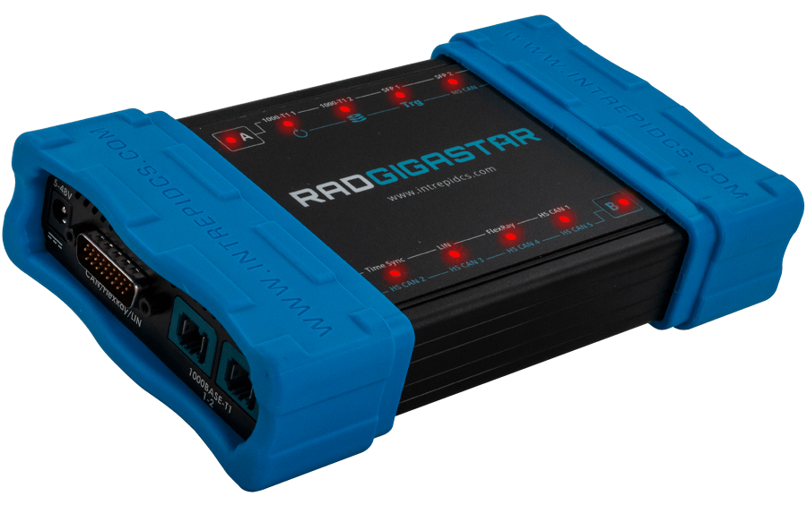

# Vehicle Network Interface Hardware: RAD-Gigastar

#### 1000BASE-T1 Active Tap, Gateway, Media Converter, Vehicle Interface & Data Logger

The RAD-Gigastar is the most versatile Automotive Ethernet network tap available. The RAD-Gigastar works as an active tap, media converter, vehicle interface, and Ethernet data logger.

The RAD-Gigastar can monitor one pair of 100/1000BASE-T1\* connections with an additional pair of SFP cages to support optical/ copper SFP transceivers. In addition, the RAD-Gigastar can also operate as a programmable gateway to create an Ethernet-to-Ethernet or a CAN-Ethernet gateway.

<figure><figcaption>
Overview of RAD-Gigastar
</figcaption></figure>

The RAD-Gigastar makes any standard Ethernet device, laptop, or data logger compatible with 100/1000BASE-T1. In addition to its Automotive Ethernet capabilities, it offers 6x ISO CAN FD channels, 2x FlexRay channels, and standalone operation capability.

User Guide for RAD-Gigastar - [https://cdn.intrepidcs.net/guides/rad-gigastar](https://cdn.intrepidcs.net/guides/rad-gigastar/)
