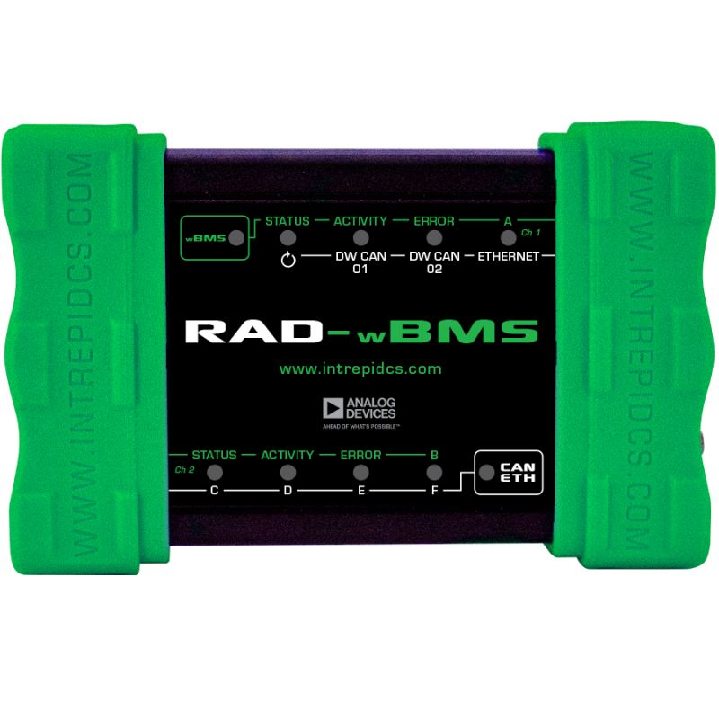

# Vehicle Network Interface Hardware: RAD-wBMS

Intrepid has partnered with Analog Devices to create a state of the art battery cell measurement and network testing hardware using the wBMS (Wireless Battery Management System®) technology. The RAD-wBMS is an adaptor designed to interface between ADI’s electric vehicle wBMS and legacy test platforms in a variety of use cases. It contains ADI wBMS radios and isoSPI interfaces with which to control and configure the wireless network components along with DW CAN-FD, 100Base-T, and USB interfaces with which to connect to legacy test platforms.

The RAD-wBMS comes pre installed with ADI’s wireless interface API (WIL) allowing easy control of the ADI wBMS network. RAD-wBMS combines Analog Devices’ wBMS technology to deliver a complete solution for monitoring critical parameters of battery systems in real time using Vehicle Spy 3 software. Parameters monitored include cell voltage, cell current, ambient temperature, cell/unit voltage, impedance, and temperature. The RAD-wBMS is compatible with many battery chemistries such as VLA, VRLA, and Li-Ion battery types.

<figure><figcaption>
RAD-wBMS device
</figcaption></figure>

RAD-wBMS User Guide - [https://cdn.intrepidcs.net/guides/RAD-wBMS/](https://cdn.intrepidcs.net/guides/RAD-wBMS/)
